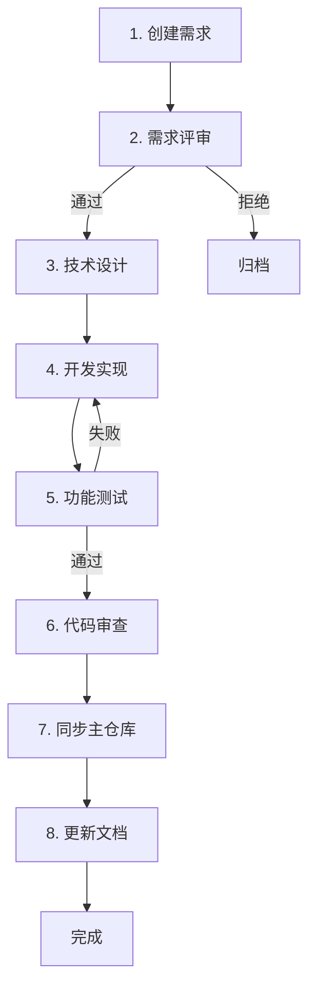

# Spec Kit 扩展开发工作流程

> 🎯 **目标**: 规范化的开发流程，确保质量和可追溯性

## 🔄 完整工作流



---

## 阶段 1: 创建需求 📝

### 1.1 填写需求表格

编辑 `.spec-workspace/requirements/REQUIREMENTS.md`：

```markdown
### EXT-003: 你的需求标题

| 字段 | 内容 |
|-----|------|
| **需求ID** | EXT-003 |
| **需求标题** | 添加 API 规格专用模板 |
| **扩展类型** | 模板扩展 |
| **影响范围** | templates/spec-template-api.md |
| **需求描述** | 创建专门用于 API 功能的 Spec 模板... |
| **输入示例** | > /speckit.specify --type api 创建用户API |
| **期望输出** | 生成包含 API 专用章节的 spec.md |
| **优先级** | P2 |
| **状态** | 待评审 |
| **验收标准** | ✅ 模板包含 API 章节... |
```

### 1.2 创建需求目录

```bash
# 创建需求目录结构
mkdir -p .spec-workspace/requirements/EXT-003

# 从模板创建详细需求文档
cp .spec-workspace/requirements/_templates/requirement-template.md \
   .spec-workspace/requirements/EXT-003/requirement.md

# 编辑详细需求
vim .spec-workspace/requirements/EXT-003/requirement.md
```

### 1.3 提交需求

```bash
# 保存并提交
git add .spec-workspace/requirements/REQUIREMENTS.md
git add .spec-workspace/requirements/EXT-003/
git commit -m "[EXT-003] Add requirement: API spec template"
git push origin feature/ext-003-api-template
```

**产出物**：
- ✅ REQUIREMENTS.md 中的需求条目
- ✅ EXT-003/requirement.md 详细需求文档
- ✅ Git 提交记录

---

## 阶段 2: 需求评审 🔍

### 2.1 自检清单

在提交评审前，确保：

- [ ] 需求描述清晰明确
- [ ] 输入输出示例完整
- [ ] 验收标准可操作、可验证
- [ ] 优先级合理
- [ ] 影响范围明确
- [ ] 技术实现方案（如有）可行

### 2.2 评审会议

评审要点：
1. 需求是否合理？
2. 是否与现有功能冲突？
3. 实现成本是否可接受？
4. 优先级是否合适？

### 2.3 评审结果

**通过**：
```bash
# 更新状态为"设计中"
vim .spec-workspace/requirements/REQUIREMENTS.md
# 修改状态字段: 待评审 → 设计中

git commit -am "[EXT-003] Approved: Move to design phase"
```

**拒绝**：
```bash
# 更新状态为"已拒绝"，添加拒绝原因
vim .spec-workspace/requirements/EXT-003/requirement.md
# 在文件末尾添加:
## 拒绝原因
- 与现有功能重复
- 实现成本过高
- 优先级不足

git commit -am "[EXT-003] Rejected: Reason documented"
```

**产出物**：
- ✅ 评审决策记录
- ✅ 更新后的状态

---

## 阶段 3: 技术设计 🏗️

### 3.1 创建设计文档

```bash
# 从模板创建设计文档
cp .spec-workspace/requirements/_templates/design-template.md \
   .spec-workspace/requirements/EXT-003/design.md

# 编辑设计方案
vim .spec-workspace/requirements/EXT-003/design.md
```

### 3.2 设计内容

`design.md` 应包含：

1. **架构设计**
   - 系统组件
   - 数据流
   - 接口定义

2. **技术选型**
   - 使用的技术和工具
   - 为什么选择这些技术

3. **实现方案**
   - 具体实现步骤
   - 需要修改的文件
   - 代码示例

4. **风险分析**
   - 潜在风险
   - 缓解措施

5. **测试策略**
   - 如何测试
   - 测试覆盖范围

### 3.3 设计评审

```bash
# 提交设计文档供评审
git add .spec-workspace/requirements/EXT-003/design.md
git commit -m "[EXT-003] Add technical design document"
git push

# 创建 PR 供团队评审
gh pr create --title "[EXT-003] Technical Design Review" \
             --body "Please review the technical design for API spec template"
```

**产出物**：
- ✅ design.md 技术设计文档
- ✅ 设计评审 PR

---

## 阶段 4: 开发实现 💻

### 4.1 在工作区开发

```bash
# 切换到工作区
cd .spec-workspace

# 创建实验性文件（不污染主仓库）
mkdir -p templates/
cp ../templates/spec-template.md templates/spec-template-api.md

# 开发和修改
vim templates/spec-template-api.md
```

### 4.2 创建实现记录

```bash
# 记录实现过程
cp requirements/_templates/implementation-template.md \
   requirements/EXT-003/implementation.md

vim requirements/EXT-003/implementation.md
```

`implementation.md` 记录：
- 修改了哪些文件
- 为什么这样修改
- 遇到的问题和解决方案
- 改进和优化

### 4.3 本地测试

```bash
# 在 sandbox 中测试
cd sandbox/

# 创建测试用例
mkdir -p test-prds/
cat > test-prds/api-example.md << 'EOF'
# User Login API PRD
...
EOF

# 测试命令（手动在 AI 编辑器中）
# > /speckit.specify sandbox/test-prds/api-example.md

# 检查生成的输出
ls -la test-outputs/
```

### 4.4 更新状态

```bash
# 更新状态为"测试中"
vim requirements/REQUIREMENTS.md
# 状态: 开发中 → 测试中

git commit -am "[EXT-003] Implementation completed, ready for testing"
```

**产出物**：
- ✅ 修改后的模板文件（在工作区）
- ✅ implementation.md 实现记录
- ✅ 本地测试结果

---

## 阶段 5: 功能测试 🧪

### 5.1 创建测试用例

```bash
# 从模板创建测试文档
cp requirements/_templates/tests-template.md \
   requirements/EXT-003/tests.md

vim requirements/EXT-003/tests.md
```

### 5.2 执行测试

`tests.md` 包含的测试类型：

#### 5.2.1 功能测试
```markdown
## 测试用例 1: 基本功能
**输入**: API PRD 文档
**预期输出**: 包含 API 专用章节的 spec.md
**实际结果**: ✅ 通过 / ❌ 失败
**备注**: [问题描述]
```

#### 5.2.2 集成测试
```markdown
## 测试用例 2: Plan 集成
**步骤**:
1. 生成 API spec
2. 运行 /speckit.plan
**预期**: plan.md 正确解析 API spec
**结果**: ✅ 通过
```

#### 5.2.3 回归测试
```markdown
## 测试用例 3: 向后兼容
**步骤**: 使用原有功能生成非 API spec
**预期**: 功能不受影响
**结果**: ✅ 通过
```

### 5.3 自动化验证

```bash
# 运行验证工具
.spec-workspace/tools/validate-requirement.sh EXT-003

# 检查输出
# ✅ 所有必需文件存在
# ✅ 所有验收标准有对应测试
# ✅ 所有测试都记录了结果
```

### 5.4 测试报告

在 `tests.md` 末尾添加汇总：

```markdown
## 测试汇总

- **测试用例总数**: 8
- **通过**: 7
- **失败**: 1
- **跳过**: 0
- **通过率**: 87.5%

## 失败分析

### TC-005: 边界情况测试
**原因**: 空 PRD 文档未正确处理
**修复**: 添加输入验证
**状态**: 已修复待重测
```

**产出物**：
- ✅ tests.md 完整测试文档
- ✅ 测试结果记录
- ✅ 所有测试通过

---

## 阶段 6: 代码审查 👀

### 6.1 准备审查

```bash
# 确保所有文档齐全
ls -la .spec-workspace/requirements/EXT-003/
# requirement.md      ✅
# design.md           ✅
# implementation.md   ✅
# tests.md            ✅

# 确保所有测试通过
grep "通过率" .spec-workspace/requirements/EXT-003/tests.md
# 通过率: 100%  ✅
```

### 6.2 自审清单

- [ ] 代码符合项目规范
- [ ] 注释清晰完整
- [ ] 所有测试通过
- [ ] 文档齐全
- [ ] 无硬编码
- [ ] 错误处理完善
- [ ] 向后兼容

### 6.3 创建 PR

```bash
git add .spec-workspace/requirements/EXT-003/
git commit -m "[EXT-003] Complete implementation and testing"
git push origin feature/ext-003-api-template

# 创建 PR
gh pr create \
  --title "[EXT-003] Add API spec template" \
  --body "$(cat .spec-workspace/requirements/EXT-003/requirement.md)"
```

### 6.4 Review 反馈

根据 PR 反馈：
- 修改代码
- 更新文档
- 重新测试
- 推送更新

**产出物**：
- ✅ GitHub PR
- ✅ Code Review 完成

---

## 阶段 7: 同步主仓库 🔄

### 7.1 验证前检查

```bash
# 使用同步工具的 dry-run 模式
.spec-workspace/tools/sync-to-main.sh EXT-003 --dry-run

# 输出示例:
# 📋 Sync Plan for EXT-003:
# 
# Files to copy:
#   .spec-workspace/templates/spec-template-api.md
#     → templates/spec-template-api.md
# 
# Files to update:
#   templates/commands/specify.md (add API detection logic)
# 
# Documentation updates:
#   README.md (add API template section)
```

### 7.2 执行同步

```bash
# 实际执行同步
.spec-workspace/tools/sync-to-main.sh EXT-003

# 工具会:
# 1. 复制文件到主仓库对应位置
# 2. 更新相关文档
# 3. 生成同步报告
```

### 7.3 验证同步结果

```bash
# 检查文件已正确复制
ls -la templates/spec-template-api.md  # ✅ 存在

# 运行主仓库的测试
# 在 AI 编辑器中测试 /speckit.specify

# 验证文档更新
git diff README.md
```

### 7.4 提交到主仓库

```bash
# 提交同步的文件
git add templates/spec-template-api.md
git add templates/commands/specify.md
git add README.md
git commit -m "[EXT-003] Add API spec template

- Add spec-template-api.md for API-specific specifications
- Update specify.md to detect API type
- Update README with API template documentation

Closes #XXX"

git push origin feature/ext-003-api-template
```

**产出物**：
- ✅ 主仓库文件已更新
- ✅ Git 提交记录
- ✅ 功能可用

---

## 阶段 8: 更新文档 📚

### 8.1 更新需求状态

```bash
vim .spec-workspace/requirements/REQUIREMENTS.md

# 更新 EXT-003:
# - 状态: 测试中 → 已完成
# - 完成时间: 2026-03-04
# - 开发者: your-name
```

### 8.2 更新变更日志

```bash
vim .spec-workspace/docs/CHANGELOG.md

# 添加条目:
## [Unreleased]

### Added
- [EXT-003] API spec template for API-specific specifications
```

### 8.3 更新架构文档

```bash
vim .spec-workspace/docs/ARCHITECTURE.md

# 记录架构决策:
## ADR-003: API Spec Template

**Date**: 2026-03-04
**Status**: Accepted
**Context**: Need specialized template for API specifications
**Decision**: Create separate spec-template-api.md
**Consequences**: Improved API documentation quality
```

### 8.4 最终提交

```bash
git add .spec-workspace/requirements/REQUIREMENTS.md
git add .spec-workspace/docs/CHANGELOG.md
git add .spec-workspace/docs/ARCHITECTURE.md
git commit -m "[EXT-003] Update documentation for completion"
git push
```

**产出物**：
- ✅ 需求状态已更新
- ✅ 变更日志已更新
- ✅ 架构决策已记录

---

## 🎉 完成

```bash
# 合并 PR
gh pr merge --squash

# 删除特性分支
git branch -d feature/ext-003-api-template

# 庆祝 🎊
echo "EXT-003 完成! 🚀"
```

---

## 📋 快速参考

### 常用命令

```bash
# 创建需求
mkdir -p .spec-workspace/requirements/EXT-XXX

# 验证需求
.spec-workspace/tools/validate-requirement.sh EXT-XXX

# 生成测试
.spec-workspace/tools/generate-test.sh EXT-XXX

# 同步到主仓库 (dry-run)
.spec-workspace/tools/sync-to-main.sh EXT-XXX --dry-run

# 同步到主仓库 (实际执行)
.spec-workspace/tools/sync-to-main.sh EXT-XXX
```

### 状态转换

| 从 | 到 | 操作 |
|----|----| -----|
| - | 待评审 | 创建需求 |
| 待评审 | 设计中 | 评审通过，创建 design.md |
| 设计中 | 开发中 | 开始编码，创建 implementation.md |
| 开发中 | 测试中 | 完成开发，创建 tests.md |
| 测试中 | 开发中 | 测试失败，修复问题 |
| 测试中 | 已完成 | 所有测试通过，同步到主仓库 |

### 提交消息规范

```
[EXT-XXX] <type>: <subject>

Types:
- Add: 添加新功能
- Update: 更新现有功能
- Fix: 修复问题
- Docs: 文档更新
- Test: 测试相关
- Refactor: 重构代码

Examples:
[EXT-003] Add: API spec template
[EXT-003] Update: Enhance specify command for API detection
[EXT-003] Docs: Update README with API template usage
[EXT-003] Test: Add integration tests for API spec
```

---

## 🔧 故障排除

### 问题: 同步脚本失败

```bash
# 检查文件是否存在
ls -la .spec-workspace/requirements/EXT-XXX/

# 检查所有必需文档是否完整
.spec-workspace/tools/validate-requirement.sh EXT-XXX

# 手动执行同步步骤
cp .spec-workspace/templates/file.md templates/file.md
```

### 问题: 测试失败

```bash
# 查看详细测试结果
cat .spec-workspace/requirements/EXT-XXX/tests.md

# 重新运行特定测试
# [手动在 AI 编辑器中测试]

# 检查是否有文件遗漏
git status
```

### 问题: PR 合并冲突

```bash
# 更新主分支
git checkout main
git pull origin main

# 切回特性分支并 rebase
git checkout feature/ext-xxx
git rebase main

# 解决冲突后继续
git add .
git rebase --continue
git push --force-with-lease
```

---

**版本**: 1.0.0  
**最后更新**: 2026-03-03  
**维护者**: Spec Kit 开发团队
