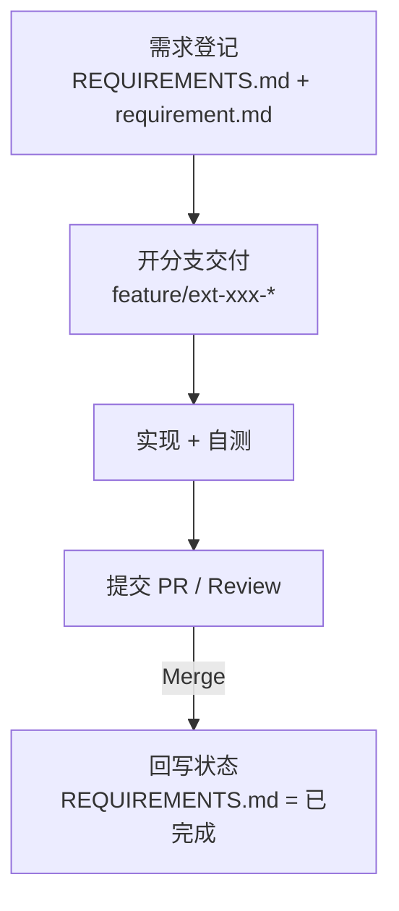

# Spec Kit 交付工作流（需求管理 + 分支交付）

> 🎯 **目标**：`.spec-workspace` 只做需求管理；所有代码/模板/文档交付改动都在仓库根目录通过 Git 分支完成。

## 🔄 总览



## 1) 需求管理（只在 `.spec-workspace` 做）

最小产出物：
- `.spec-workspace/requirements/REQUIREMENTS.md`：条目 + 状态
- `.spec-workspace/requirements/EXT-XXX/requirement.md`：需求详情 + 验收标准

推荐做法：

```bash
vim .spec-workspace/requirements/REQUIREMENTS.md
mkdir -p .spec-workspace/requirements/EXT-003
cp .spec-workspace/requirements/_templates/requirement-template.md \
  .spec-workspace/requirements/EXT-003/requirement.md
vim .spec-workspace/requirements/EXT-003/requirement.md
```

可选校验：

```bash
.spec-workspace/tools/validate-requirement.sh EXT-003
```

## 2) 交付实现（在仓库根目录开分支）

分支命名建议：
- `feature/ext-003-brief-description`

开分支：

```bash
git switch -c feature/ext-003-brief-description
```

交付原则：
- 直接修改主工作区文件（`templates/`、`src/`、`docs/`…），不要走“复制/同步”流程
- Commit message / PR 标题包含 `EXT-XXX`，便于追溯

示例提交：

```bash
git commit -am "[EXT-003] Add <something>"
```

## 3) 合并与关闭需求

当 PR 合并后：
1. 将 `.spec-workspace/requirements/REQUIREMENTS.md` 中对应条目更新为 `已完成`
2. （可选）在条目中补充 PR/commit 链接

## ✅ Definition of Done（建议）

- PR 已合并到 `main`/`master`
- 需求条目状态已更新为 `已完成`
- 验收标准已在 PR 中逐条覆盖（可用测试/截图/日志/说明证明）
