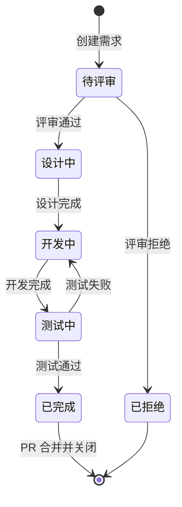

# Spec Kit 扩展需求管理表

> 📍 **位置**: `.spec-workspace/requirements/REQUIREMENTS.md`  
> 🎯 **目的**: 统一管理所有扩展需求，追踪开发进度

## 📋 字段说明

| 字段 | 说明 | 格式要求 |
|-----|------|---------|
| **需求ID** | 唯一标识符 | `EXT-XXX` (三位数字，从001开始) |
| **需求标题** | 简短描述需求内容 | 不超过50字符 |
| **扩展类型** | 需求分类 | `命令增强` / `新增命令` / `模板扩展` / `CLI增强` |
| **影响范围** | 受影响的文件或组件 | 列出所有相关文件 |
| **需求描述** | 详细的功能需求说明 | 清晰描述想要什么功能 |
| **输入示例** | 用户如何使用 | 提供具体的使用示例 |
| **期望输出** | 期望得到什么结果 | 描述期望的行为和输出 |
| **技术实现** | 建议的实现方式 | 技术方案建议（可选） |
| **优先级** | 重要程度 | `P0`(紧急) / `P1`(高) / `P2`(中) / `P3`(低) |
| **状态** | 当前进度 | `待评审` / `设计中` / `开发中` / `测试中` / `已完成` / `已拒绝` |
| **验收标准** | 如何验证功能正确实现 | 列出可验证的具体标准 |
| **开发者** | 负责人 | GitHub 用户名或姓名 |
| **创建时间** | 需求创建日期 | YYYY-MM-DD |
| **完成时间** | 需求完成日期 | YYYY-MM-DD |

---

## 🎯 需求列表

### EXT-001: 支持 PRD 文档转换为 Spec

| 字段 | 内容 |
|-----|------|
| **需求ID** | EXT-001 |
| **需求标题** | 支持 PRD 文档转换为 Spec |
| **扩展类型** | 命令增强 |
| **影响范围** | • `templates/commands/specify.md`<br>• `templates/spec-template.md`<br>• 所有 AI agent 的 specify 命令文件 |
| **需求描述** | 当前 `/speckit.specify` 只支持简短的功能描述输入。需要增强以支持完整的 PRD 文档作为输入，并将其标准化转换为 Spec Kit 规范的 spec.md 格式。<br><br>**核心能力**：<br>1. 识别用户输入是文件路径还是描述文本<br>2. 读取并解析 PRD 文档结构<br>3. 将 PRD 各章节映射到 Spec 标准格式<br>4. 保留所有需求和验收标准细节<br>5. 保持与现有简短描述模式的向后兼容 |
| **输入示例** | **场景1: 文件路径**<br>```<br>> /speckit.specify docs/prd/user-authentication.md<br>```<br><br>**场景2: @引用（AI编辑器）**<br>```<br>> /speckit.specify @login-prd.md<br>```<br><br>**场景3: 粘贴完整内容**<br>```<br>> /speckit.specify<br><br>请根据以下PRD生成spec：<br>[粘贴完整PRD内容]<br>```<br><br>**场景4: 简短描述（向后兼容）**<br>```<br>> /speckit.specify 添加用户登录功能<br>``` |
| **期望输出** | 生成标准的 `spec.md` 文件，包含：<br><br>**从 PRD 映射的内容**：<br>• 业务目标 → Spec 背景说明<br>• 用户故事 → Given-When-Then 测试场景<br>• 功能需求 → `REQ-001`, `REQ-002`...<br>• 非功能需求 → `NFR-001`, `NFR-002`...<br>• 技术约束 → `CONST-001`（如适用）<br>• 验收标准 → Success Criteria checkboxes<br><br>**质量要求**：<br>• 所有场景必须可测试（Given-When-Then）<br>• 所有需求必须编号且不重复<br>• 保留原 PRD 的所有细节<br>• 格式符合 Spec Kit 规范 |
| **技术实现** | **第一阶段：模板增强**（无需修改CLI代码）<br><br>1. 更新 `templates/commands/specify.md`：<br>   ```markdown<br>   - 添加输入类型检测逻辑<br>   - 添加 PRD 章节映射规则表<br>   - 添加转换示例和最佳实践<br>   - 保持向后兼容的简短描述模式<br>   ```<br><br>2. 增强 `templates/spec-template.md`：<br>   ```markdown<br>   - 添加 PRD 映射注释指引<br>   - 标注各章节对应的 PRD 来源<br>   - 优化章节说明<br>   ```<br><br>3. 创建指导文档：<br>   ```<br>   - PRD 转换最佳实践<br>   - 映射规则详细说明<br>   - 常见问题和处理方式<br>   ```<br><br>**第二阶段：CLI 增强**（可选，未来版本）<br>```python<br># 在 specify CLI 中添加文件检测<br>if args and os.path.isfile(args):<br>    with open(args) as f:<br>        content = f.read()<br>    # 传递给 AI<br>``` |
| **优先级** | P1 |
| **状态** | 待评审 |
| **验收标准** | **功能验收**：<br>✅ 能识别输入是文件路径、@引用还是文本描述<br>✅ 能正确读取 PRD 文档内容<br>✅ 业务目标正确转换为背景说明<br>✅ 用户故事转为完整的 Given-When-Then 场景<br>✅ 功能需求正确编号（REQ-001, REQ-002...）<br>✅ 非功能需求正确编号（NFR-001, NFR-002...）<br>✅ 技术约束正确标识（CONST-001...）<br>✅ 验收标准转为可勾选的 checklist<br><br>**集成验收**：<br>✅ 生成的 spec.md 可被 `/speckit.plan` 正确解析<br>✅ 生成的 spec.md 可被 `/speckit.tasks` 正确解析<br>✅ 生成的 spec.md 可被 `/speckit.checklist` 正确处理<br><br>**兼容性验收**：<br>✅ 原有简短描述功能完全不受影响<br>✅ 所有现有测试用例通过<br><br>**质量验收**：<br>✅ 所有生成的场景都是可测试的<br>✅ 所有需求编号无重复、无跳号<br>✅ 生成的文档符合 Markdown 规范 |
| **测试用例** | 在 PR/CI 中覆盖（在本条目补充链接即可） |
| **开发者** | - |
| **创建时间** | 2026-03-03 |
| **完成时间** | - |

**相关文件**：
- 📄 [详细需求](./EXT-001/requirement.md)

---

### EXT-002: Spec 模板新增产品设计规范层（UML + UI 元素定义）

| 字段 | 内容 |
|-----|------|
| **需求ID** | EXT-002 |
| **需求标题** | Spec 模板新增产品设计规范层（UML + UI 元素定义） |
| **扩展类型** | 模板扩展 |
| **影响范围** | `templates/spec-template.md` |
| **需求描述** | 当前 `spec-template.md` 面向工程验收设计，缺少产品设计与评审所需的规范层。需新增：<br>1. **Actors & System Boundary**（用例图文本表达）：显式声明参与者和系统边界<br>2. **User Interaction Flows**（交互流程图）：结构化描述多步骤、分支、异常路径<br>3. **Entity State Machines**（状态机图）：集中管理实体状态枚举和转换矩阵<br>4. **UI Component Specification**（UI 元素定义）：提供含内涵与口径的前端实现契约 |
| **输入示例** | 产品经理填写 Spec 时，在 User Story 之外同步填写交互流程图和 UI 组件定义，供评审和开发参考 |
| **期望输出** | 更新后的 `spec-template.md` 包含 4 个可选新增小节，产品评审、开发实现、测试验收三方均能从 Spec 获取无歧义的完整规格 |
| **技术实现** | 纯模板扩展，不涉及 CLI 代码修改；已落地至 `templates/spec-template-EXT-002.md` |
| **优先级** | P1 |
| **状态** | 已完成 |
| **验收标准** | ✅ 模板包含 4 个新增小节<br>✅ 每个小节有完整填写说明和示例<br>✅ 各层之间 ID 引用关系在注释中有说明<br>✅ 原有 3 个必填小节内容未被删改 |
| **测试用例** | 在 PR/CI 中覆盖（在本条目补充链接即可） |
| **开发者** | - |
| **创建时间** | 2026-03-03 |
| **完成时间** | 2026-03-03 |

**相关文件**：
- 📄 [详细需求](./EXT-002/requirement.md)

---

### EXT-003: Contract SSoT 粒度与 Interface ID 绑定 UX Flow

| 字段 | 内容 |
|-----|------|
| **需求ID** | EXT-003 |
| **需求标题** | Contract SSoT 粒度与 Interface ID 绑定 UX Flow |
| **扩展类型** | 模板扩展 |
| **影响范围** | • `templates/spec-template-EXT-002.md`（需求约束参考）<br>• 需求文档链路：`contracts/`、`ux-flow`、`smoke-tests` |
| **需求描述** | 将接口契约（Contract SSoT）的粒度与命名规则明确到 `I-XXX`。要求 UX Flow 的节点到接口映射（Flow Node → Interface ID）能够追溯到契约表，确保 Plan 阶段产物中 contracts、ux-flow、smoke-tests 的 ID 引用完全自洽。 |
| **输入示例** | 在 Plan 文档中定义：`contracts/I-001.md`、`contracts/I-002.md`，并在 UX Flow 节点中引用 `I-001` / `I-002`；smoke tests 的每条用例记录对应 `I-XXX`。 |
| **期望输出** | 1) Contract SSoT 以 `I-XXX` 为最小粒度进行约束；<br>2) UX Flow 存在 Node-to-Interface Mapping 表；<br>3) Smoke tests 存在 `Flow Node` ↔ `I-XXX` ↔ `Test Case` 的追溯关系；<br>4) 文档评审可在不看代码的情况下验证 ID 一致性。 |
| **技术实现** | 本 EXT 仅落地需求文档层：新增需求文档、设计占位、测试占位、实现记录占位；不修改主模板内容与 CLI。 |
| **优先级** | P1 |
| **状态** | 待评审 |
| **验收标准** | ✅ requirement.md 明确 `I-XXX` 命名与粒度规则<br>✅ requirement.md 明确 Flow Node → Interface ID 的映射约束<br>✅ validate-requirement.sh 校验通过 |
| **测试用例** | 在 PR/CI 中覆盖（在本条目补充链接即可） |
| **开发者** | - |
| **创建时间** | 2026-03-03 |
| **完成时间** | - |

**相关文件**：
- 📄 [详细需求](./EXT-003/requirement.md)

---

### EXT-004: Smoke Tests + Interface Design 门禁与最小设计包

| 字段 | 内容 |
|-----|------|
| **需求ID** | EXT-004 |
| **需求标题** | Smoke Tests + Interface Design 门禁与最小设计包 |
| **扩展类型** | 模板扩展 |
| **影响范围** | • 需求文档链路：`ux-flow` / `contracts` / `smoke-tests`<br>• 接口级设计文档产物：`I-XXX` 级最小设计包 |
| **需求描述** | 增加两类门禁：<br>1) Smoke Tests 必须由 UX Flow + Contract SSoT 推导，并提供 Traceability Matrix；<br>2) 每个接口必须具备最小接口设计文档（`I-XXX`），至少包含类方法级时序图、伪代码逻辑、自动化测试策略、源码变更清单。 |
| **输入示例** | 对 `I-003` 提供最小设计包：时序图、伪代码、自动化测试策略、源码变更清单；并在 smoke tests 中以矩阵列出 `Flow Node / I-003 / TC-xxx`。 |
| **期望输出** | 1) Smoke tests 具备可审核的 Traceability Matrix；<br>2) 所有 `I-XXX` 接口具备最小设计包；<br>3) 明确边界：不与 Data Model 类图重复，类图仍归属 data-model 文档。 |
| **技术实现** | 本 EXT 仅落地需求文档层，不新增 CLI 功能，不修改主模板内容。 |
| **优先级** | P1 |
| **状态** | 待评审 |
| **验收标准** | ✅ requirement.md 明确 Smoke Tests 推导来源与追溯矩阵要求<br>✅ requirement.md 明确 `I-XXX` 最小设计包四项必备内容<br>✅ requirement.md 明确 data-model 类图边界<br>✅ validate-requirement.sh 校验通过 |
| **测试用例** | 在 PR/CI 中覆盖（在本条目补充链接即可） |
| **开发者** | - |
| **创建时间** | 2026-03-03 |
| **完成时间** | - |

**相关文件**：
- 📄 [详细需求](./EXT-004/requirement.md)

---

### EXT-005: Evidence Chain / Call Chain 治理门禁（不做 CLI）

| 字段 | 内容 |
|-----|------|
| **需求ID** | EXT-005 |
| **需求标题** | Evidence Chain / Call Chain 治理门禁（不做 CLI） |
| **扩展类型** | 模板扩展 |
| **影响范围** | • Research/Plan 阶段文档规则<br>• 术语规范与检查清单<br>• 仓库历史依据引用格式 |
| **需求描述** | 在 Research/Plan 阶段加入治理规则：必须引用仓库历史实现作为依据，并给出从入口（controller/handler/route）到下游调用链的 evidence/call chain（文件路径、符号、commit、PR 链接等）。允许“未找到”，但必须记录检索范围、关键词、结论与风险。 |
| **输入示例** | 在 Plan 中增加 evidence chain 区块：入口 `handler` → service → repository；每跳记录文件路径与符号；补充 commit/PR 引用。若未检索到历史实现，记录搜索范围与风险。 |
| **期望输出** | 1) Research/Plan 文档具备治理门禁与术语规范；<br>2) 有 evidence/call chain 记录模板；<br>3) “未找到”场景具备标准化记录格式；<br>4) 不引入新的 CLI 功能。 |
| **技术实现** | 本 EXT 仅落地文档层（模板/门禁/检查清单与术语规范），明确不实现新的 CLI 功能。 |
| **优先级** | P1 |
| **状态** | 待评审 |
| **验收标准** | ✅ requirement.md 明确 Evidence Chain / Call Chain 的最小记录要求<br>✅ requirement.md 明确“未找到”时的必填记录项（范围/关键词/结论/风险）<br>✅ requirement.md 明确“仅文档治理，不做 CLI”边界<br>✅ validate-requirement.sh 校验通过 |
| **测试用例** | 在 PR/CI 中覆盖（在本条目补充链接即可） |
| **开发者** | - |
| **创建时间** | 2026-03-03 |
| **完成时间** | - |

**相关文件**：
- 📄 [详细需求](./EXT-005/requirement.md)

---

## 📊 需求状态面板

### 按优先级

| P0 紧急 | P1 高优先级 | P2 中等 | P3 低优先级 |
|---------|-----------|--------|-----------|
| - | EXT-001, EXT-002, EXT-003, EXT-004, EXT-005 | - | - |

### 按状态

| 待评审 | 设计中 | 开发中 | 测试中 | 已完成 | 已拒绝 |
|--------|--------|--------|--------|--------|--------|
| EXT-001, EXT-003, EXT-004, EXT-005 | - | - | - | EXT-002 | - |

### 详细状态表

| 需求ID | 标题 | 类型 | 优先级 | 状态 | 开发者 | 创建日期 | 预计完成 |
|--------|------|------|--------|------|--------|----------|----------|
| EXT-001 | PRD转Spec | 命令增强 | P1 | 待评审 | - | 2026-03-03 | - |
| EXT-002 | Spec 产品设计规范层 | 模板扩展 | P1 | 已完成 | - | 2026-03-03 | 2026-03-03 |
| EXT-003 | Contract SSoT 与 Interface ID 绑定 | 模板扩展 | P1 | 待评审 | - | 2026-03-03 | - |
| EXT-004 | Smoke Tests 与最小接口设计包门禁 | 模板扩展 | P1 | 待评审 | - | 2026-03-03 | - |
| EXT-005 | Evidence/Call Chain 治理门禁 | 模板扩展 | P1 | 待评审 | - | 2026-03-03 | - |

---

## 🔄 工作流状态转换



### 状态说明

| 状态 | 说明 | 下一步 |
|-----|------|--------|
| **待评审** | 需求已提交，等待技术评审 | 评审会议讨论 |
| **设计中** | 评审通过，补齐技术方案（可写在 PR 描述/设计文档） | 创建交付分支 |
| **开发中** | 在交付分支上实现改动 | 自测 + 提交 PR |
| **测试中** | 在交付分支上验证验收标准 | 合并 PR |
| **已完成** | PR 已合并到 `main`/`master` | 回写状态 + 追溯链接 |
| **已拒绝** | 需求不合理或不可行 | 归档 |

---

## 📝 快速操作

### 创建新需求

```bash
# 1. 复制需求ID
NEXT_ID="EXT-006"  # 递增编号

# 2. 创建需求目录
mkdir -p .spec-workspace/requirements/$NEXT_ID

# 3. 从模板创建文件
cp .spec-workspace/requirements/_templates/requirement-template.md \
   .spec-workspace/requirements/$NEXT_ID/requirement.md

# 4. 编辑需求
vim .spec-workspace/requirements/$NEXT_ID/requirement.md

# 5. 更新本文件（REQUIREMENTS.md）
# 复制 EXT-005 模板，修改为 EXT-006，填写内容
```

### 推进需求状态

```bash
# 1) 更新 REQUIREMENTS.md 的状态字段（例如：待评审 → 开发中）
vim .spec-workspace/requirements/REQUIREMENTS.md

# 2) 在仓库根目录开分支交付
git switch -c feature/ext-001-brief-description

# 3) 实现改动并提交（message/PR 标题包含 EXT-001）
git commit -am "[EXT-001] <your change summary>"

# 4) PR 合并后：将状态更新为 已完成，并可补充 PR/commit 链接
```

### 验证需求

```bash
# 使用验证工具
.spec-workspace/tools/validate-requirement.sh EXT-001

# 手动检查清单
# ✅ requirement.md 存在且完整
# ✅ REQUIREMENTS.md 中存在条目且字段齐全
# ✅ 验收标准可验证（测试/截图/日志/说明均可）
```

---

## 📖 相关资源

### 文档
- [工作区说明](../README.md) - 工作区结构和使用方法
- [开发工作流](../docs/WORKFLOW.md) - 详细的开发流程

### 模板
- [需求模板](`./_templates/requirement-template.md`)

### 工具
- `validate-requirement.sh` - 验证需求完整性

---

## 📈 统计信息

- **总需求数**: 5
- **待评审**: 4
- **设计中**: 0
- **开发中**: 0
- **测试中**: 0
- **已完成**: 1
- **完成率**: 20%

---

**最后更新**: 2026-03-03  
**维护者**: Spec Kit 开发团队  
**版本**: 2.0.0
