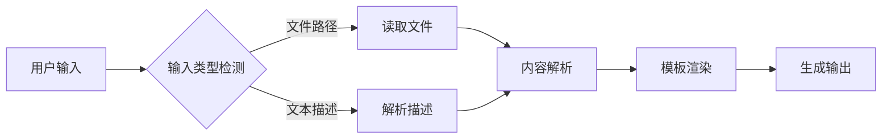

# EXT-XXX 技术设计

> 📋 **需求ID**: EXT-XXX  
> 🏗️ **设计者**: [你的名字]  
> 📅 **设计日期**: YYYY-MM-DD  
> 📊 **状态**: 设计中/已完成

---

## 📐 架构设计

### 系统概览

```
[系统架构图或流程图]

示例:
┌─────────────┐      ┌──────────────┐      ┌─────────────┐
│   用户输入   │─────▶│  命令处理器   │─────▶│  模板引擎   │
└─────────────┘      └──────────────┘      └─────────────┘
                            │
                            ▼
                     ┌──────────────┐
                     │  文件生成器   │
                     └──────────────┘
```

### 组件说明

#### 组件 1: [组件名称]
**职责**: [此组件负责什么]  
**输入**: [接收什么数据]  
**输出**: [产生什么数据]  
**依赖**: [依赖哪些其他组件]

#### 组件 2: [组件名称]
[类似格式]

---

## 🔧 技术选型

### 选择的技术

| 技术/工具 | 版本 | 用途 | 选择原因 |
|----------|------|------|---------|
| Markdown | - | 模板格式 | 易读易写，广泛支持 |
| YAML | 1.2 | 配置文件 | 结构化，易解析 |
| [其他] | - | [用途] | [原因] |

### 备选方案对比

| 方案 | 优点 | 缺点 | 决策 |
|-----|------|------|------|
| 方案 A | [优点] | [缺点] | ❌ 未选择 |
| 方案 B | [优点] | [缺点] | ✅ **已选择** |

---

## 📁 文件结构

### 新增文件

```
templates/
├── spec-template-[type].md       # 新增的模板文件
└── commands/
    └── [command-name].md         # 新增或修改的命令

.claude/commands/
└── [command-name].md             # 更新的 Claude 命令

[其他受影响的目录]
```

### 修改文件

| 文件路径 | 修改类型 | 修改内容 |
|---------|---------|---------|
| `templates/commands/specify.md` | 增强 | 添加新的输入类型检测 |
| `templates/spec-template.md` | 增强 | 添加新的章节注释 |

---

## 🔍 详细设计

### 功能模块 1: [模块名称]

#### 输入处理

```python
# 伪代码示例
def detect_input_type(input_string):
    """检测输入是文件路径还是描述文本"""
    if is_file_path(input_string):
        return "file"
    elif starts_with_at(input_string):
        return "reference"
    else:
        return "text"
```

#### 处理逻辑

```python
def process_input(input_string, input_type):
    """根据输入类型处理"""
    if input_type == "file":
        content = read_file(input_string)
        return parse_document(content)
    else:
        return generate_from_description(input_string)
```

#### 输出生成

```python
def generate_output(parsed_data):
    """生成最终输出"""
    template = load_template()
    return render_template(template, parsed_data)
```

### 功能模块 2: [模块名称]

[类似格式]

---

## 🔄 数据流

### 数据流程图



### 数据结构

```yaml
# 中间数据结构示例
parsed_data:
  type: "prd_document"
  sections:
    business_goals:
      - "目标1"
      - "目标2"
    user_stories:
      - id: "US-001"
        description: "作为用户..."
        acceptance_criteria: ["标准1", "标准2"]
    requirements:
      functional:
        - id: "REQ-001"
          description: "系统必须..."
      non_functional:
        - id: "NFR-001"
          description: "性能要求..."
```

---

## 🎨 接口设计

### 命令接口

```markdown
---
description: "命令描述"
---

# 命令名称

## 参数

- `$ARGUMENTS` - 用户输入（文件路径或文本描述）
- `--option` - 可选参数（如果有）

## 返回值

生成的文件: `output.md`
```

### 模板接口

```markdown
# 模板标题: {{title}}

## 章节 1
{{section1_content}}

## 章节 2
{{section2_content}}
```

---

## ⚠️ 风险分析

### 风险 1: [风险描述]

**可能性**: 高/中/低  
**影响**: 高/中/低  
**缓解措施**:
- [措施1]
- [措施2]

**应急计划**:
- [如果发生，如何处理]

### 风险 2: [风险描述]

[类似格式]

---

## 🧪 测试策略

### 单元测试

测试范围：
- [ ] 输入类型检测
- [ ] 文件读取功能
- [ ] 内容解析逻辑
- [ ] 模板渲染

### 集成测试

测试场景：
- [ ] 完整的 PRD 转 Spec 流程
- [ ] 与 `/speckit.plan` 的集成
- [ ] 与 `/speckit.tasks` 的集成

### 性能测试

性能目标：
- 小文件 (< 10KB): < 1秒
- 大文件 (> 100KB): < 5秒

---

## 🔄 向后兼容性

### 兼容性保证

- ✅ 保持现有简短描述功能不变
- ✅ 不修改现有 API
- ✅ 新功能为可选增强

### 迁移指南

**对现有用户的影响**: 无  
**是否需要迁移**: 否  
**迁移步骤**: N/A

---

## 📈 性能考虑

### 性能要求

| 操作 | 响应时间 | 吞吐量 |
|-----|---------|--------|
| 文件读取 | < 100ms | N/A |
| 内容解析 | < 500ms | N/A |
| 模板渲染 | < 200ms | N/A |
| 总计 | < 1s | 10 ops/min |

### 优化策略

- [优化点1]
- [优化点2]

---

## 🔐 安全考虑

### 安全检查

- [ ] 输入验证（防止路径遍历）
- [ ] 文件大小限制
- [ ] 权限检查
- [ ] 错误信息不泄露敏感信息

### 安全措施

```python
# 示例：文件路径验证
def validate_file_path(path):
    # 检查路径是否在允许的目录内
    # 防止路径遍历攻击
    allowed_dirs = [".spec-workspace/", "docs/"]
    return any(path.startswith(d) for d in allowed_dirs)
```

---

## 📚 实现计划

### 阶段 1: 基础功能（Week 1）

- [ ] 实现输入类型检测
- [ ] 实现文件读取功能
- [ ] 创建基本模板

### 阶段 2: 核心逻辑（Week 1-2）

- [ ] 实现 PRD 解析逻辑
- [ ] 实现章节映射
- [ ] 实现模板渲染

### 阶段 3: 测试和优化（Week 2）

- [ ] 单元测试
- [ ] 集成测试
- [ ] 性能优化

### 阶段 4: 文档和发布（Week 2）

- [ ] 更新用户文档
- [ ] 创建示例
- [ ] 发布和部署

---

## 🤔 未解决问题

### 问题 1: [问题描述]
**建议方案**: [可能的解决方案]  
**需要讨论**: [与谁讨论]

### 问题 2: [问题描述]
[类似格式]

---

## 📝 设计决策记录

### ADR-001: [决策主题]

**日期**: YYYY-MM-DD  
**状态**: 已接受/已拒绝/已废弃  
**背景**: [为什么需要做这个决策]  
**决策**: [决定做什么]  
**后果**: [这个决策的影响]

### ADR-002: [决策主题]

[类似格式]

---

## 👥 评审记录

### 2026-03-03 - 初始设计评审

**参与者**: [名单]  
**反馈**:
- [反馈1]
- [反馈2]

**行动项**:
- [需要执行的事项]

---

**设计者**: [你的名字]  
**评审者**: [评审者名单]  
**最后更新**: YYYY-MM-DD  
**版本**: 1.0
