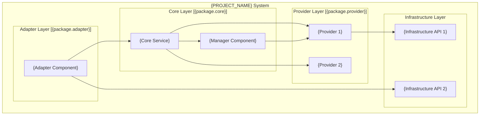

# {PROJECT_NAME} System Architecture Design and Coding Standards（系统架构设计与编码规范）

> **定位**: 定义系统架构、分层约束、编码规范与项目实施准入契约。
> **消费阶段**: Plan（§1-§6）、Task（§7.1）、Imp（§7）

---

## Part A: System Architecture Design（部分A：系统架构设计）

## 1. Architecture Overview（架构总览）

### 1.1 Scope（适用范围）

- 项目类型: `{PROJECT_TYPE}`（如：规范定义类项目、后端服务、前端应用）
- 主要产物: `{PRIMARY_ARTIFACTS}`（如：Markdown 规范、微服务、CLI 工具）
- 非目标: `{OUT_OF_SCOPE}`（如：业务后端实现、UI 开发）

### 1.2 Design Principles（设计原则）

- SRP（Single Responsibility Principle / 单一职责）
- ISP（Interface Segregation Principle / 接口隔离）
- DIP（Dependency Inversion Principle / 依赖倒置）
- Contract-First（契约优先）

## 2. Core Technology Selection (Fixed Versions)（核心技术选型）

### 2.1 Tech Stack Matrix（技术栈矩阵）

| Category（类别） | Component（组件） | Version（版本） | Purpose（用途） | DependencyLayer（依赖层） |
| --- | --- | --- | --- | --- |
| Runtime | {RUNTIME_COMPONENT} | {RUNTIME_VERSION} | 应用框架/运行时 | All |
| Build | {BUILD_COMPONENT} | {BUILD_VERSION} | 构建与打包 | All |
| Language | {LANGUAGE_COMPONENT} | {LANGUAGE_VERSION} | 目标运行时 | All |
| Web Framework | {WEB_FRAMEWORK} | {WEB_VERSION} | HTTP 服务/API 网关 | Adapter |
| RPC | {RPC_COMPONENT} | {RPC_VERSION} | 服务调用/RPC | Adapter |
| Serialization | {SERIALIZATION_LIB} | {SERIALIZATION_VERSION} | 序列化/反序列化 | Adapter |
| Validation | {VALIDATION_LIB} | {VALIDATION_VERSION} | 参数校验 | Adapter |
| ORM | {ORM_COMPONENT} | {ORM_VERSION} | ORM 与持久层 | Provider |
| DB | {DB_COMPONENT} | {DB_VERSION} | 关系型数据库 | Infrastructure |
| NoSQL | {NOSQL_COMPONENT} | {NOSQL_VERSION} | 文档/KV 数据库 | Infrastructure |
| Graph | {GRAPH_COMPONENT} | {GRAPH_VERSION} | 图数据库 | Infrastructure |
| Cache | {CACHE_COMPONENT} | {CACHE_VERSION} | 分布式缓存 | Infrastructure |
| MQ | {MQ_COMPONENT} | {MQ_VERSION} | 消息队列 | Infrastructure |
| Search | {SEARCH_ENGINE} | {SEARCH_VERSION} | 全文检索 | Infrastructure |
| Observability | {OBSERVABILITY_STACK} | {OBSERVABILITY_VERSION} | 监控/追踪/日志聚合 | Infrastructure |
| Test | {TEST_COMPONENT} | {TEST_VERSION} | 单元/集成测试 | All |
| Logging | {LOGGING_FRAMEWORK} | {LOGGING_VERSION} | 日志框架 | All |
| Container | {CONTAINER_RUNTIME} | {CONTAINER_VERSION} | 容器化运行时 | Deployment |
| Orchestration | {ORCHESTRATION_TOOL} | {ORCHESTRATION_VERSION} | 容器编排 | Deployment |

### 2.2 Middleware Selection Guide（中间件选型指南）

> **定位**: 规范项目中使用的第三方服务与中间件，确保架构一致性。

#### 2.2.1 Caching Middleware（缓存中间件）

| Scenario（场景） | RecommendedOption（推荐方案） | Version（版本） | Reason（理由） |
| --- | --- | --- | --- |
| 分布式缓存 | {CACHE_SOLUTION} | {CACHE_VERSION} | {CACHE_REASON} |
| 本地缓存 | {LOCAL_CACHE_SOLUTION} | {LOCAL_CACHE_VERSION} | {LOCAL_CACHE_REASON} |
| 会话存储 | {SESSION_STORE} | {SESSION_VERSION} | {SESSION_REASON} |

#### 2.2.2 Messaging Middleware（消息中间件）

| Scenario（场景） | RecommendedOption（推荐方案） | Version（版本） | Reason（理由） |
| --- | --- | --- | --- |
| 异步任务 | {ASYNC_MQ} | {ASYNC_MQ_VERSION} | {ASYNC_MQ_REASON} |
| 事件驱动 | {EVENT_STREAM} | {EVENT_VERSION} | {EVENT_REASON} |
| 实时通知 | {NOTIFICATION_MQ} | {NOTIFICATION_VERSION} | {NOTIFICATION_REASON} |

#### 2.2.3 Storage Middleware（存储中间件）

| Scenario（场景） | RecommendedOption（推荐方案） | Version（版本） | Reason（理由） |
| --- | --- | --- | --- |
| 关系型数据 | {RDBMS} | {RDBMS_VERSION} | {RDBMS_REASON} |
| 文档存储 | {DOCUMENT_DB} | {DOCUMENT_VERSION} | {DOCUMENT_REASON} |
| 对象存储 | {OBJECT_STORAGE} | {OBJECT_VERSION} | {OBJECT_REASON} |
| 全文检索 | {SEARCH_ENGINE} | {SEARCH_VERSION} | {SEARCH_REASON} |

#### 2.2.4 Observability Middleware（可观测性中间件）

| Scenario（场景） | RecommendedOption（推荐方案） | Version（版本） | Reason（理由） |
| --- | --- | --- | --- |
| 分布式追踪 | {TRACING_TOOL} | {TRACING_VERSION} | {TRACING_REASON} |
| 指标监控 | {METRICS_TOOL} | {METRICS_VERSION} | {METRICS_REASON} |
| 日志聚合 | {LOG_AGGREGATOR} | {LOG_VERSION} | {LOG_REASON} |
| APM | {APM_SOLUTION} | {APM_VERSION} | {APM_REASON} |

### 2.3 Technology Constraints（技术选型约束）

- **版本锁定**: 所有中间件版本必须在此文档中明确定义，禁止私自升级。
- **依赖审批**: 新增中间件必须经过架构评审，更新本文档。
- **兼容性验证**: 版本升级前必须完成兼容性测试（参见 `research.md` 兼容性矩阵）。
- **License 合规**: 禁止引入 GPL/AGPL 等传染性 License 的组件（商业项目）。

## 3. Core Modules and Responsibilities（核心模块与职责）

- **{MODULE_NAME_1}** (`{module-adapter}`): {模块职责描述}（如：协议适配、路由与序列化）
- **{MODULE_NAME_2}** (`{module-core}`): {模块职责描述}（如：核心业务逻辑编排）
- **{MODULE_NAME_3}** (`{module-service}`): {模块职责描述}（如：领域服务实现）
- **{MODULE_NAME_4}** (`{module-provider}`): {模块职责描述}（如：数据提供与访问）
- **{MODULE_NAME_5}** (`{module-infrastructure}`): {模块职责描述}（如：基础设施支持）
- **{MODULE_NAME_6}** (`{module-product}`): {模块职责描述}（如：产品打包与启动）

## 4. Package Topology Diagram（包拓扑图）



## 5. Layered Architecture Rules（分层架构规范）

### 5.1 Layer Definitions and Dependency Constraints（分层定义与依赖约束）

**架构约束**（ArchUnit 验证）:

| ConstraintID（约束ID） | ConstraintDescription（约束描述） | VerificationTool（验证工具） |
|---------|----------|----------|
| PKG-01 | 包依赖必须是 DAG（无循环） | JDepend |
| PKG-02 | 依赖方向: Adapter → Core → Provider → Infrastructure | ArchUnit |
| PKG-03 | 禁止反向依赖（Core 不依赖 Adapter，Provider 不依赖 Core） | ArchUnit |
| PKG-04 | Adapter 不可直接调用 Provider | ArchUnit |

### 5.2 Layered Tech Stack（分层技术栈）

| Layer | Technology | Version | Purpose |
| --- | --- | --- | --- |
| Adapter | {ADAPTER_TECH} | {ADAPTER_VERSION} | {适配层职责说明} |
| Core | {CORE_TECH} | {CORE_VERSION} | {核心层职责说明} |
| Provider | {PROVIDER_TECH} | {PROVIDER_VERSION} | {提供层职责说明} |
| Infrastructure | {INFRA_TECH} | {INFRA_VERSION} | {基础设施层职责说明} |
| Build | {BUILD_TECH} | {BUILD_VERSION} | 构建与打包 |
| Test | {TEST_TECH} | {TEST_VERSION} | 单元/契约/集成测试 |

### 5.3 Object-Type Definitions and Conversion Boundaries（类项目定义与转换边界）

**依据**: UML 模型映射规范中的类图定义（Task: 字段级，Plan: 概览级）。

#### 5.3.1 Object Types and Layer Ownership（对象类型与层归属）

| ObjectType（对象类型） | OwningLayer（归属层） | RulesAndBoundaries（规则与边界） | Forbidden（禁止） |
|---|---|---|---|
| DTO / VO | Adapter | 仅 Adapter 层，负责转换 | 不可穿透到 Core/Provider |
| Entity / Value Object | Core | 仅 Core 内部使用 | 不跨 Adapter 直接暴露 |
| BO (Business Object) | Core | 业务逻辑载体 | 不可暴露到 Adapter |
| Domain Service | Core | 复杂业务协调，无基础设施依赖 | 不直接依赖 Provider 实现 |
| Use Case / Application Service | Core | 对外业务入口 | 仅经 Adapter 调用 |
| Repository (接口) | Core | 仅定义接口 | 由 Provider 实现 |
| Repository (实现) | Provider | Provider → Infrastructure，不回流 Core | 不暴露到 Core |
| Provider Client | Provider | 下游访问，通过接口注入 | 不回调 Adapter |
| PO (Persistent Object) / Data Model | Provider | 仅 Provider 层使用 | 不可暴露到 Core/Adapter |
| Config / Infra Bean | Infrastructure | 基础设施支持 | 不包含业务逻辑 |

#### 5.3.2 Object Conversion Boundaries（对象转换边界）

- **Adapter ↔ Core**: DTO/VO ↔ BO（在 Adapter 层完成转换）
- **Core ↔ Provider**: BO ↔ PO（在 Provider 层完成转换）
- **禁止**: 跨两层直接转换（如 DTO → PO）
- **禁止**: Core 直接依赖 Provider/Infrastructure 的实现类
- **禁止**: Provider 回调 Adapter，保持单向依赖

## 6. Project Structure Standards（项目结构标准）

### 6.1 Standard Directories (Specification Projects)（标准目录：规范定义类项目）

```text
{PROJECT_ROOT}/
├─ memory/
│  ├─ constitution.md           # 治理基础
│  └─ architecture.md           # 本文档
├─ templates/
│  ├─ commands/                 # 命令模板
│  │  ├─ {COMMAND_NAME_1}.md
│  │  └─ {COMMAND_NAME_2}.toml
│  ├─ {TEMPLATE_CATEGORY_1}/
│  └─ {TEMPLATE_CATEGORY_2}/
├─ scripts/
│  ├─ bash/
│  │  └─ {ACTION_OBJECT}.sh
│  └─ powershell/
│     └─ {ACTION_OBJECT}.ps1
└─ src/
   └─ {CLI_PACKAGE}/
```

### 6.2 Standard Directories (Application Projects)（标准目录：应用开发项目）

```text
{PROJECT_ROOT}/
├─ src/
│  ├─ {module-adapter}/        # Adapter 层
│  ├─ {module-core}/           # Core 层
│  ├─ {module-provider}/       # Provider 层
│  └─ {module-infrastructure}/ # Infrastructure 层
├─ tests/
│  ├─ unit/
│  ├─ integration/
│  └─ contract/
└─ memory/
   └─ architecture.md          # 本文档
```

### 6.3 SOLO Project Directory (Single-Repo Mode)（SOLO项目目录）

> 适用于前后端、多模块均在同一仓库内的项目。关键原则：内部模块通过代码层 API 契约交互，而非网络协议。

```text
{PROJECT_ROOT}/
├─ apps/                          # 应用入口（各可独立部署）
│  ├─ web/                        # 前端应用
│  │  ├─ src/
│  │  ├─ public/
│  │  └─ package.json
│  └─ api/                        # 后端 API 服务
│     ├─ src/
│     └─ {BUILD_CONFIG}
├─ packages/                      # 共享包（内部 API 契约层）
│  ├─ shared-types/               # 前后端共享类型定义
│  ├─ shared-utils/               # 通用工具函数
│  └─ contracts/                  # 内部模块间 API 契约
├─ tests/
│  ├─ unit/
│  ├─ integration/
│  └─ e2e/                        # 端到端测试（跨模块）
├─ docs/
│  └─ ux/                         # 原型产出（SOLO 模式自动生成）
└─ memory/
   └─ constitution.md
```

**SOLO 模式依赖约束**:
- `packages/` 内的共享包为模块间契约的唯一交互点，禁止 `apps/` 之间直接导入
- `shared-types/` 为前后端共享类型的 SSoT，避免重复定义
- 内部模块依赖关系必须在 `packages/contracts/` 中显式声明

### 6.4 Naming Constraints（命名约束）

- 文档命名: `{name-kebab-or-fixed}.md`
- 命令模板命名: `{command-name}.md` 或 `{command-name}.toml`
- 脚本命名: `{action-object}.sh` / `{action-object}.ps1`
- 占位符命名: 全大写蛇形 `{PLACEHOLDER_NAME}`

---

## Part B: Coding Standards and Implementation Admission（部分B：编码规范与实施准入）

## 7. Pre-Coding Standards (Task/Imp High-Frequency Constraints)（前置编码规范）

> 以下 §7.1-§7.4 为高频实现约束，在 Task 阶段引用、Imp 阶段完整前置。

### 7.1 Layer Admission Rules (Precondition Required)（分层准入规范）

**参见**: §5.3 类项目定义与转换边界

**核心约束**：

- Controller 只做参数校验 + DTO 转换 + 调用 Service
- Service 不直接操作数据库，通过 Repository 接口
- Repository 实现层不包含业务逻辑
- **禁止**: Controller 直接注入 Repository
- **禁止**: Service 层返回 PO 给 Controller

### 7.2 Logging Rules (Precondition Required)（日志规范）

- 统一使用 `{LOGGING_FRAMEWORK}`
- 日志级别:
  - **ERROR**: 异常、错误
  - **WARN**: 降级、警告
  - **INFO**: 业务关键路径
  - **DEBUG**: 调试信息
- **禁止**: `System.out.println` / `console.log` / `print()` 等直接输出
- **必须**: 结构化日志，包含 `{LOG_CONTEXT_FIELDS}`（如：traceId / userId / actionType）
- **敏感数据**: 禁止记录密码、token、完整身份证号、银行卡号等

### 7.3 MVC / Layered Invocation Rules (Precondition Required)（分层调用规范）

> **参见 §7.1**：本节核心约束与 §7.1 一致，此处补充 MVC 视角的额外说明。

- 严格遵循 §7.1 分层准入规范中的所有约束
- **MVC 映射**: Controller = Adapter 层入口，Service = Core 层业务编排，Repository = Provider 层数据访问
- **禁止**: 跨层直接调用（如 Controller → Repository），必须经过 Service 层中转

### 7.4 Exception Handling Rules (Precondition Required)（异常处理规范）

- 统一异常层次结构：`{BUSINESS_EXCEPTION}` → `{SYSTEM_EXCEPTION}`
- Controller 层统一异常拦截（全局 ExceptionHandler / Error Middleware）
- **禁止**: 吞掉异常（catch 后不处理不记录）
- **禁止**: 暴露系统内部异常堆栈给 API 调用方
- **必须**: 异常信息包含错误码 `{ERROR_CODE}`、错误描述 `{ERROR_MESSAGE}`

---

## 8. Business Architecture Extensions (Optional)（业务应用架构扩展）

> **定位**: 本章节为业务应用开发项目预留，可按项目类型补充。

### 8.1 Domain-Specific Architecture Patterns (Optional)（特定领域架构模式）

根据项目类型补充特定架构模式：

- **微服务架构**: 服务划分、通信模式、服务治理
- **事件驱动架构**: 事件定义、发布订阅、事件溯源
- **CQRS 架构**: 命令查询分离、读写模型

### 8.2 Deployment and Operations Architecture (Optional)（部署与运维架构）

- **容器化方案**: `{CONTAINER_PLATFORM}`
- **CI/CD 流水线**: `{CI_CD_TOOL}`
- **监控与告警**: `{MONITORING_STACK}`
- **灾备与恢复**: `{DISASTER_RECOVERY_STRATEGY}`
