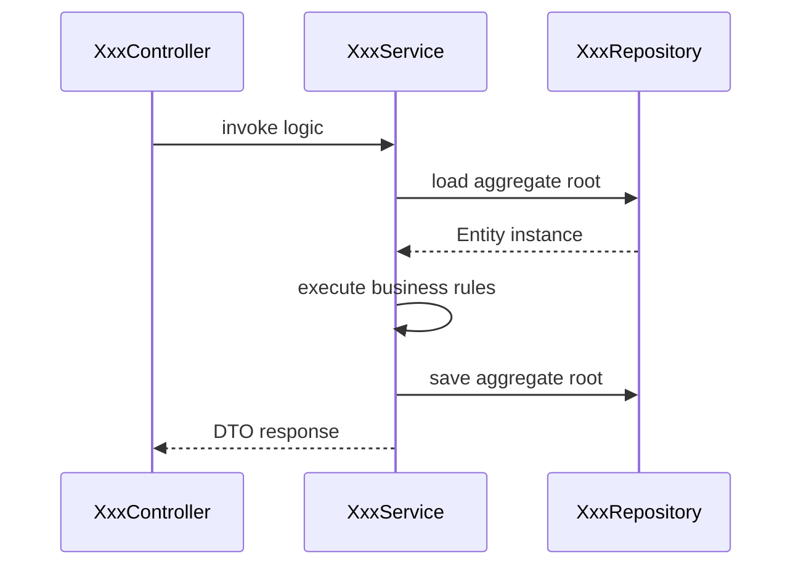
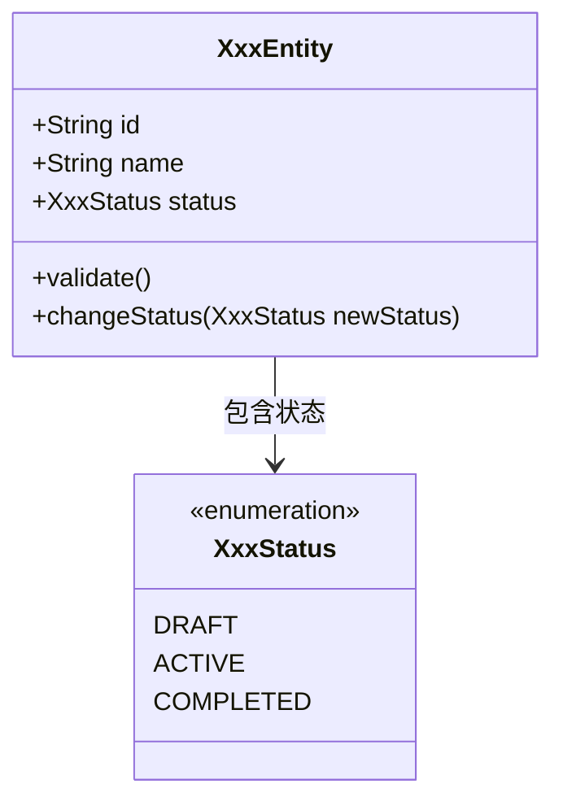

# Class Model Design（类模型设计）: [FEATURE]

**Plan**: [plan.md](./plan.md) | **Date**: [DATE] | **Phase**: Phase 4 - Data Model + Logical Schema

---

## Overview（概述）

本文档定义 [FEATURE] 的核心领域类与 Class Model（类模型），作为 Phase 4 的核心产物，直接指导后续的 Interface Design（接口设计）编写。
**注意：允许表达 Logical Schema（列/类型/索引/约束）以承载一致性设计，但禁止输出可执行 DDL（如 CREATE/ALTER SQL）。**

### Success Criteria Check（门禁）

- [ ] 所有类是否与 `spec.md` 中的业务领域模型一致？
- [ ] 状态迁移表是否已将业务状态精确下沉到了类字段级别？
- [ ] 核心组件之间的交互是否通过组件级时序图表达清晰？
- [ ] 是否补齐 Logical Schema（列/类型/索引/约束）且未出现可执行 DDL？

---

## Component Sequence Diagram（组件级时序图）

> 展示系统内部各逻辑组件（如 Controller, Domain Service, Repository 等）如何协作以实现核心功能。
> 这是一个基于宏观架构组件的交互推理。

---

## Core Class Diagram（核心类图） (Class Diagram)

> **核心属性定义与关系**
> 包含主要的属性定义、属性约束条件（如必填、校验规则），以及类与类之间的关系（聚合、组合等）。

### Design Pattern Usage Notes（设计模式应用说明） (Design Patterns)

> 记录本模块采用的核心设计模式（如工厂模式、策略模式、状态模式等）。

- **[模式名称]**: [应用场景描述及涉及的类]

---

## Logical Schema Mapping（逻辑表结构映射） (Logical Schema, Non-DDL)

> 用于表达领域对象到持久化结构的逻辑映射（列/类型/索引/约束），
> **仅用于设计说明，不生成可执行 DDL**。

| Logical Table | Column | Type | Nullable | Key/Index | Constraint | Source (Entity/VO/DTO/PO) |
|---------------|--------|------|----------|-----------|------------|----------------------------|
| `xxx_main` | `id` | `varchar(64)` | No | PK | 唯一主键 | `XxxEntity.id` |
| `xxx_main` | `status` | `varchar(32)` | No | IDX(`status`) | 必须属于 `XxxStatus` 枚举 | `XxxEntity.status` |
| `xxx_main` | `updated_at` | `timestamp` | No | IDX(`updated_at`) | 变更时自动刷新（逻辑规则） | `XxxPO.updatedAt` |

---

## State Transition Mapping（状态迁移映射） (State Transition to Class Fields)

> **SSoT**: 对 `spec.md` 业务状态机的精细化。
> 将业务状态的流转规则，严格映射到具体类的字段操作上。

| CurrentStateEnum（当前状态枚举值） | AllowedNextState（允许流转的下一个状态） | TransitionMethod（状态流转方法） | ValidationConstraints（校验与约束条件） |
|----------------|----------------------|-------------------------------|----------------|
| `DRAFT`        | `ACTIVE`             | `XxxEntity.activate()`         | 必须校验 name 属性非空 |
| `ACTIVE`       | `COMPLETED`          | `XxxEntity.complete()`         | 需要存在相关子项 |

---

**后续步骤**:
基于此 Class Model（含 Logical Schema）以及 `research.md` 的技术结论，前往 Phase 5 编写针对每个接口的 Interface Design `contracts/I-XXX-*.md`。
