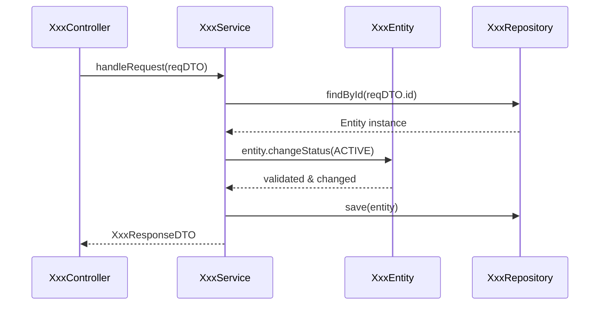

# Interface Design（接口设计）: [I-XXX-InterfaceName（接口名）]

**Interface ID**: [I-XXX] | **Method**: [GET/POST/PUT/DELETE] | **Path**: [/api/v1/...]
**Phase**: Phase 5 - Interface Design

---

## Overview（概述）

本文档是 **Coding 前的最小颗粒度设计**，是下游代码实施阶段（Imp）唯一的详细输入来源。
**所有的业务逻辑伪代码、类方法的调用时序，以及对 `contracts/api.contract-table.md` 参数契约的还原（可选参考 `contracts/api.openapi.yaml` 导出视图），都在此定义。**

### Dependencies（依赖声明） (Inputs)
- **契约主源 (SSoT)**: `contracts/api.contract-table.md`
- **可选导出视图**: `contracts/api.openapi.yaml`（若存在）
- **Class Model（类模型）**: `data-model.md`
- **技术可行性与选型结论**: `research.md`

### Gate Checklist（门禁Checklist（检查清单））

- [ ] 是否以表格形式 1:1 还原了本接口在 `contracts/api.contract-table.md` 中的字段契约（若有 OpenAPI 导出则与其一致）？
- [ ] 时序图是否精确到了“类和方法”级别（`ClassA.methodB()`）？
- [ ] 伪代码逻辑是否覆盖了主流程、各种分支、错误处理以及前置研究中的技术要求？

---

## §1 Interface Contract Reconstruction（接口参数契约还原）

> **目标**: 将 `contracts/api.contract-table.md` 中该接口的字段契约还原到此表格中。
> 这样在实施阶段，开发者/代理只需阅读本文档即可掌握所有进出参结构的上下文。
>
> **OpenAPI 3.0（可选）一致性建议**: 若存在 `contracts/api.openapi.yaml` 导出视图，可将其作为一致性校验参考；
> 但字段语义与约束的主源仍以 `contracts/api.contract-table.md` 为准。

### Request Parameters（入参）

| ParameterName（参数名） | Location（所在位置） | Type（类型） | Required（是否必填） | BusinessMeaning（业务含义说明） | DataConstraints（数据约束条件） |
|--------|-----------------------------------|------|----------|--------------|--------------|
| [如: id] | Path | String | 是 | 核心实体的唯一标识 | 必须为 UUID |
| [如: payload] | Body | Object | 是 | 提交的表单数据 | 包含必填的 name 和可选的 desc |

### Response Parameters（出参）

| HTTPStatus（HTTP状态码） | ResponseRootField（响应根字段） | Type（类型） | BusinessMeaning（业务含义说明） | InternalClassMappingDTO（内部类映射） |
|-------------|------------|------|--------------|------------------|
| 200 | data | Object | 成功返回的数据体 | `XxxResponseDTO` |
| 400 | error | Object | 业务校验失败的错误信息 | `ErrorResponseDTO` |

---

## §2 Class-Level Sequence Diagram（类方法级时序图） (Class-Level Sequence Diagram)

> **目标**: 细化 `data-model.md`（Phase 4）中的组件级时序设计，展示在一次具体的接口调用链路中，各个具体的类及其方法之间是如何交互传参的。



---

## §3 Detailed Pseudocode Logic（伪代码详细逻辑） (Pseudo Code & Business Logic)

> **目标**: 承载此接口的具体执行蓝图，包含参数校验、核心领域逻辑调用、持久化操作、技术中间件集成（如缓存、MQ），以及错误异常抛出。开发者可直接将此伪代码“翻译”为对应语言的源代码。

### XxxController Class（XxxController类）

```java
// 伪代码: Controller 入口
public Response handleRequest(RequestDTO reqDTO) {
    // 1. DTO 基础格式参数校验 (@Valid 等)
    // 2. 调用 Service 层
    try {
        ResponseDTO res = xxxService.process(reqDTO);
        return success(res);
    } catch (BusinessException e) {
        return error(e.getCode(), e.getMessage());
    }
}
```

### XxxService Class（核心编排）

```java
// 伪代码: Service 编排逻辑
public ResponseDTO process(RequestDTO req) {
    // 1. 前置技术要求检查 (参考 research.md)
    // - 例如：尝试从 Redis 缓存获取，命中则直接返回
    
    // 2. 领域对象组装与加载 (参考 data-model.md)
    XxxEntity entity = xxxRepository.findById(req.getId());
    if (entity == null) {
        throw new BusinessException(2001, "实体不存在");
    }
    
    // 3. 核心领域逻辑执行
    // 严格遵循 data-model.md 中的状态机约束
    entity.changeStatus(ACTIVE);
    
    // 4. 持久化 (或技术预研建议的异步入队)
    xxxRepository.save(entity);
    
    // 5. 构造 ResponseDTO 并返回
    return constructResponseDTO(entity);
}
```

---

## §4 Automated Test Strategy（自动化测试策略） (Test Strategy)

> 指导如何对此段接口逻辑进行验证。

- **Smoke (冒烟)**: [验证最基础的成功链路]
- **E2E (端到端)**: [结合外部系统的复杂场景，或从创建到修改的全流程验证]
- **异常路径验证**: [故意传入非法参数、触发并发修改等，验证是否抛出预期的错误码]

---

## §5 Source Code Change Inventory（源码变更清单） (Source Code Change Inventory)

> 列出实现本接口将要**新增**或**修改**的文件路径清单。这为实施代理 (Imp Agent) 提供明确的改动边界。

- `src/controllers/XxxController.java` (新增/修改)
- `src/services/XxxService.java` (新增/修改)
- `src/models/XxxEntity.java` (新增/修改)
- `src/repositories/XxxRepository.java` (新增/修改)
- `src/dto/RequestDTO.java` (新增)
- `src/dto/ResponseDTO.java` (新增)
