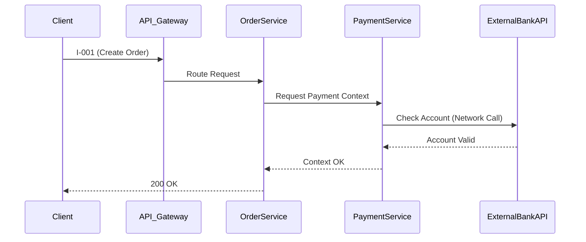

# Technical Research and Feasibility Design（技术预研与可行性设计）: [FEATURE]

**Plan**: [plan.md](./plan.md) | **Date**: [DATE] | **Phase**: Phase 3 - Research

---

## Overview（概述）

本文档承接 Phase 1 生成的 `contracts/api.contract-table.md`（接口契约主源，SSoT；`contracts/api.openapi.yaml` 仅作为可选导出视图）。
其目标是对契约进行**完备性检查**，并通过**服务级时序图推理**发现宏观架构上的链路风险与缺失，最终对复杂技术点（如高并发、三方集成、复杂算法）给出明确的选型结论或指导方案。

> **注意：本文档仅输出技术层面的"可行性结论"。不负责直接定义或改变底层数据结构和 Class Model 的设计。结论供下游详细设计参考与吸收。**

### Success Criteria Check（门禁）

- [ ] 是否基于 `contracts/api.contract-table.md` 识别了所有必需的上下文信息和现存代码系统之间的依赖缺失？
- [ ] 涉及复杂业务逻辑或外部系统的交互，是否已通过服务级时序体验证？
- [ ] CRUD 场景或技术探索类难点是否已经得到明确的预研结论？

---

## Service-Level Sequence Verification（服务级时序验证） (Service-Level Sequence Diagram)

> **目标**: 在涉及外部系统集成、跨域服务调用或复杂的分布式交互时，使用服务级时序图进行推理验证，确保宏观链路打通。

### Macro Flow Risk Assessment（宏观链路风险评估）

| InteractionNode（交互节点） | PotentialRisk（潜在风险） | ConclusionsAndMitigations（结论与缓解建议） |
|----------|------------------------------|---------------------------------|
| `PaymentService -> BankAPI` | 银行接口可能超时 (P99 > 3s) | 建议引入断路器模式，异步轮询结果。 |

---

## Completeness and Context Check（完备性与上下文检查） (Contract SSoT vs Existing System)

> **目标**: 对比 `contracts/api.contract-table.md` 定义的契约字段与现有系统（代码/上下文）能力，检查是否缺少支撑该契约所需的先决条件；若存在 `contracts/api.openapi.yaml`，仅用于一致性校对。

### CRUD Scenario Support Check（场景支持情况检查）

| InterfaceID（接口ID） | APIRequiredContextFields（API所需关键上下文/字段） | ExistingSystemSupport（现有系统支持） | ContextGapNotes（上下文缺失说明） | SuggestedApproach（建议方案） |
|---------|-------------------------|------------------------|------------------------|-----------------------------------|
| `I-001` | `user_nickname`         | ❌ 未提供              | 现有 User 模块缺少昵称字段 | 需向下游模块索要扩展字段，或进行数据字典扩展 |
| `I-002` | `transaction_history`   | ✅ 已提供              | N/A                    | 直接调用既有 `HistoryService` |

---

## Technical Challenges and Architecture Decisions（技术难点与架构选型） (Technical Exploration & Decisions)

> **目标**: 针对特有的性能、算法或特殊中间件需求，输出明确选型或设计结论。

### Challenge（难点） 1: [e.g., high-concurrency writes（如：高并发写入）]

- **问题描述**: 在大促期间，`I-001` 接口可能面临超过 2000 QPS 的突发写入。
- **可选方案**:
  1. 传统 DB 直写（容易宕机）
  2. Redis 缓存排队，异步落库
  3. MQ 削峰填谷
- **预研结论与选型**: **方案 3 (MQ 削峰)**。推荐使用 RabbitMQ，在接口层仅写入消息队列即返回，后台消费入库。

### Challenge（难点） 2: [e.g., core recommendation algorithm integration（如：核心推荐算法集成）]

- **问题描述**: 接口返回的列表需要经过特定的推荐算法排序，如何与现有的排序组件集成？
- **预研结论与选型**: 建议引入 **策略模式 (Strategy Pattern)** 封装算法细节，抽象出一个 `RankingStrategy` 接口以隔离易变逻辑。

---

**后续步骤**:
在明确了接口的宏观可行性和技术边界后，下一步将进入 Phase 4 进行纯粹的业务领域 **Class Model（类模型）设计**。
