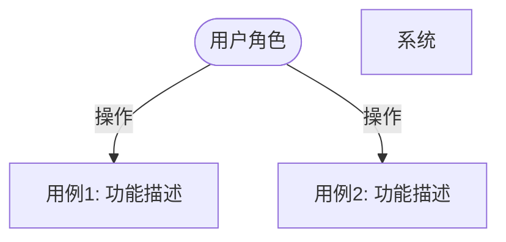
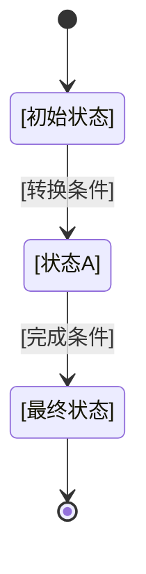

# [ProjectOrFeatureName（项目/功能名称）] Requirements Specification（需求规格文档）

**Feature Branch**: `[###-feature-name]`  
**Created**: [DATE]  
**Status**: Draft  
**Input**: User description: "$ARGUMENTS"

**上下文压缩（如需）**: Spec 保持业务表达。如需引用约束,避免重复基线,用 REF/DELTA。

```text
REF: memory/constitution.md §2-§8
DELTA: {仅列出本次差异或新增约束}
```

---

## Spec Phase Guardrail Checklist（阶段管控Checklist（检查清单）） (Guardrails)

**检查目的**: 确保 Spec 符合"术语合法性"管控要点，遵循 Ubiquitous Language（统一语言）原则。

### Terminology Validity Check（术语合法性检查）

- [ ] **所有业务术语已定义**: 本 Spec 使用的所有业务术语在 §7.1 术语表中有定义
- [ ] **无新创术语**: 未引入未经 Constitution 批准的新术语
- [ ] **Ubiquitous Language 一致性**: 使用的术语与 Constitution 定义的领域词汇表一致
- [ ] **跨域交互契约明确**: 若涉及跨领域交互，已在 §0.4 或 §7.2 中明确契约定义

### Spec/Plan Boundary Check（接口设计禁入）

- [ ] **Spec 阶段不得进行接口设计**: 禁止在 Spec 中给出 HTTP method/path、OpenAPI/Proto/SDK 方法签名、请求/响应字段契约等接口级定义
- [ ] **职责边界一致**: Spec 仅负责需求规格与 Field Specification（字段规格）说明（只读类型功能强制）；接口契约与接口详设在 Plan 阶段完成

### Domain Boundary Check（领域Boundary Check（边界检查））

- [ ] **领域归属明确**: 本 Spec 所属的 Bounded Context（限界上下文）已明确
- [ ] **Context Map 清晰**: 若与其他 Bounded Context 有依赖，已绘制 Context Map（上下文映射）
- [ ] **ACL 定义**: 跨域调用有 Anti-Corruption Layer（防腐层）设计

**检查责任人**: 需求评审团队  
**检查工具**: 人工评审 + AI 辅助术语匹配  
**拦截规则**: 术语合法性检查未通过 → 阻止进入 Plan 阶段

---

## 0. Overview（概述）

<!--
  抽象层：说明"为什么"要做这个功能
  回答：这个功能解决什么问题？为谁解决？价值是什么？
-->

### 0.1 Background and Motivation（背景与动机）

[描述业务背景，说明为什么需要这个功能，当前存在什么问题或机会]

### 0.2 Goals and Value（目标与价值）

**核心目标**: [一句话描述功能的核心目标]

**业务价值**:

- [价值点1]：[具体说明]
- [价值点2]：[具体说明]
- [价值点3]：[具体说明]

### 0.3 Stakeholders（利益相关方）

| Role（角色） | CoreNeeds（核心诉求） | ExpectedBenefits（期望收益） |
|------|----------|----------|
| [终端用户] | [需求描述] | [收益描述] |
| [业务方] | [需求描述] | [收益描述] |
| [运维人员] | [需求描述] | [收益描述] |

### 0.4 Scope and Boundaries（范围与边界）

<!--
  明确本次功能的范围边界，避免范围蔓延
-->

#### In-Scope（本期范围） (In Scope)

- [功能点1]：[详细描述]
- [功能点2]：[详细描述]
- [功能点3]：[详细描述]

#### Out-of-Scope（非In-Scope（本期范围）） (Out of Scope)

- [非范围1]：[说明为什么不在本期]
- [非范围2]：[说明为什么不在本期]

### 0.5 Spec/Plan Phase Boundary（阶段边界；强制）

- **Spec 允许**: 业务目标、用户故事、业务状态、功能需求、Field Specification 业务语义、跨域业务契约语义
- **Spec 禁止**: HTTP method/path、OpenAPI/Proto/SDK 方法签名、请求/响应字段契约、可执行 DDL、技术实现选型
- **Plan 承接**: Contract SSoT（`contracts/api.contract-table.md`）、可选 OpenAPI 导出（`contracts/api.openapi.yaml`）、Interface Design（`contracts/I-XXX-*.md`）

### 0.6 Spec Internal Consistency Check（内部一致性检查）（提交前自检）

- [ ] 术语一致性：新增术语已在 §7.1 定义，且与 `memory/constitution.md §7` 一致
- [ ] ID 一致性：Story / SC / F 的映射关系完整且可追溯
- [ ] 状态一致性：§3 状态迁移可映射到 §4 功能需求
- [ ] Field Specification 完整性：只读功能必填；状态变更/混合功能若有可见数据输出亦必填
- [ ] 阶段边界合规：无接口签名/字段契约/DDL 等越界内容
- [ ] 占位符合规：强制约束要求填写的区域不得残留占位符
- [ ] 澄清项合规：`[NEEDS CLARIFICATION]` 数量在约束范围内

---

## 1. Use Case Diagram（用例图）



---

## 2. User Stories（用户故事）

<!--
  具象层：说明"是什么"功能
  用 As a [角色], I want [功能], So that [价值] 格式描述用户需求
-->

### Story 1: [Story Title（故事标题）] (Priority: P0)

**As a** [用户角色]  
**I want** [想要什么功能]  
**So that** [达成什么目标/获得什么价值]

**场景描述**: [详细描述用户在什么情境下需要这个功能]

**验收范围** (BDD场景ID/功能ID):

- [SC-F001-001] / [F-001]：[验收意图]
- [SC-F002-001] / [F-002]：[验收意图]

### Story 2: [Story Title（故事标题）] (Priority: P1)

**As a** [用户角色]  
**I want** [想要什么功能]  
**So that** [达成什么目标/获得什么价值]

**场景描述**: [详细描述用户在什么情境下需要这个功能]

**验收范围** (BDD场景ID/功能ID):

- [SC-F003-001] / [F-003]：[验收意图]
- [SC-F004-001] / [F-004]：[验收意图]

### Story 3: [Story Title（故事标题）] (Priority: P2)

**As a** [用户角色]  
**I want** [想要什么功能]  
**So that** [达成什么目标/获得什么价值]

**场景描述**: [详细描述用户在什么情境下需要这个功能]

**验收范围** (BDD场景ID/功能ID):

- [SC-F004-002] / [F-004]：[验收意图]

---

## 3. Business State Transitions（业务状态流转）

**终态**: `[最终状态]`  **不变式**: [跨所有状态的全局约束]


### State Definition Table（状态定义表）

| From | Event | To | Guard | Action |
|------|-------|----|-------|--------|
| [初始状态] | [转换条件] | [状态A] | - | - |
| [状态A] | [完成条件] | [最终状态] | - | - |
| [任意状态] | [异常事件] | [错误状态] | [触发条件] | [回滚操作] |

### State-to-Requirement Trace Table（状态与功能需求追溯表）

| StateOrTransition（状态或转换） | TriggerFunctionID（触发功能ID） | RelatedScenarioID（关联场景ID） | Notes（说明） |
|------|------|------|------|
| [初始状态] -> [状态A] | F-001 | SC-F001-001 | [触发该迁移的业务动作] |
| [状态A] -> [最终状态] | F-002 | SC-F002-001 | [达成终态的业务动作] |
| [任意状态] -> [错误状态] | F-00X | SC-F00X-00Y | [异常处理/回滚触发] |

> 追溯规则：§3 的每个关键状态迁移至少映射一个 F-XXX 与 SC-XXX；若无映射，需在备注说明原因。

---

## 4. Functional Requirements（功能需求）

<!--
  详细层：说明"做什么功能"的细节规格
  以功能点为单位，详细描述每个功能的输入、处理、输出
-->

### 4.1 Functional Requirement Overview（功能需求概览）

| FunctionID（功能ID） | FunctionName（功能名称） | Description（描述） | Priority（优先级） | RelatedUserStory（关联用户故事） |
|--------|----------|------|--------|--------------|
| F-001 | [功能名称1] | [功能描述] | P0 | Story 1 |
| F-002 | [功能名称2] | [功能描述] | P0 | Story 1, Story 2 |
| F-003 | [功能名称3] | [功能描述] | P1 | Story 2 |
| F-004 | [功能名称4] | [功能描述] | P2 | Story 3 |

### 4.2 Functional Detailed Specification（功能详细规格）

> **强制规则（Field Specification）**：
>
> 1) **纯查询功能（不改变任何业务状态）强制填写 Field Specification（字段规格）表**（定义见 §7.1）。
>
> 2) **类型防误标规则**：若功能类型为"状态变更/混合"，但存在查询结果展示、写后回显、导出回传等可见数据输出，仍需完整填写 Field Specification 表。
>
> 3) **可见数据输出判定**：凡 Then/验收结果中出现“展示/返回/导出/回显”的业务数据项，均视为可见数据输出。
>
> **注意**：Spec 阶段仅定义业务语义，不提供接口签名与字段契约（method/path/request/response schema）。

#### F-001: [Feature Name（功能名称）1]

**功能类型**: [纯查询/状态变更/混合]

##### Field Specification（字段规格；只读必填）

> 状态变更/混合功能若存在可见数据输出，同样必填。

| FieldSpecItem（字段规格项） | Source（来源） | Required（必填） | Example（示例） | RuleNotes（规则说明） |
|---|---|---|---|---|
| [字段规格项] | [用户输入/系统已有/计算] | [是/否] | [示例值] | [过滤条件/时间范围/权限范围/聚合/去重/排序/分页/默认值等] |

```gherkin
Feature: [功能名称1] (F-001)

# Constraint: After filling, Then must reference concrete field items from the Field Specification table; placeholders must not remain.（约束）
# Example: Then display [Order List] fields [Order ID/Status/Created At] and paginate in descending [Created At] order.（示例）

Scenario: [主流程场景]
  Given [前置条件]
  When [用户/系统操作]
  Then [引用Field Specification 表中的具体字段项与规则]

Scenario: [异常场景]
  Given [异常前置条件]
  When [触发异常操作]
  Then [引用Field Specification 表中的具体字段项与规则]
```

#### F-002: [Feature Name（功能名称）2]

**功能类型**: [纯查询/状态变更/混合]

##### Field Specification（字段规格；只读必填）

> 状态变更/混合功能若存在可见数据输出，同样必填。

| FieldSpecItem（字段规格项） | Source（来源） | Required（必填） | Example（示例） | RuleNotes（规则说明） |
|---|---|---|---|---|
| [字段规格项] | [用户输入/系统已有/计算] | [是/否] | [示例值] | [过滤条件/时间范围/权限范围/聚合/去重/排序/分页/默认值等] |

```gherkin
Feature: [功能名称2] (F-002)

# Constraint: After filling, Then must reference concrete field items from the Field Specification table; placeholders must not remain.（约束）
# Example: Then display [Order List] fields [Order ID/Status/Created At] and paginate in descending [Created At] order.（示例）

Scenario: [主流程场景]
  Given [前置条件]
  When [用户/系统操作]
  Then [引用Field Specification 表中的具体字段项与规则]
```

#### 4.3 Placeholder and Mandatory-Constraint Conflict Rules（占位符与强制约束冲突处理规则）

- 优先级：**强制约束 > 占位符保留**。
- 若某条约束要求“必须给出具体值/具体要素项”，则该处不得保留占位符。
- 未被强制约束覆盖的区块，可保留占位符并在相邻处标注假设或待澄清项。

---

## 5. Non-Functional Requirements（非Functional Requirements（功能需求）） (Non-Functional Requirements)

<!--
  约束层：说明"必须遵守的约束"
  包括性能、安全、可用性、兼容性等质量属性要求
-->

### 5.1 Performance Requirements（性能需求） (Performance)

| Metric（指标） | TargetValue（目标值） | MeasurementMethod（测量方式） |
|------|--------|----------|
| 响应时间 | [如: P95 < 200ms] | [如: 性能测试工具监控] |
| 吞吐量 | [如: 1000 QPS] | [如: 压力测试] |
| 并发用户 | [如: 支持10000并发] | [如: 并发测试] |
| 数据处理量 | [如: 单次处理100万条] | [如: 批量测试] |

### 5.2 Availability Requirements（可用性需求） (Availability)

- **系统可用性**: [如: 99.9%]
- **故障恢复时间**: [如: < 5分钟]
- **数据备份**: [如: 每日备份，保留7天]

### 5.3 Security Requirements（安全需求） (Security)

- **身份认证**: [如: 支持OAuth 2.0]
- **数据加密**: [如: 传输层TLS 1.3，存储AES-256]
- **权限控制**: [如: 基于角色的访问控制RBAC]
- **审计日志**: [如: 记录所有敏感操作]

### 5.4 Compatibility Requirements（兼容性需求） (Compatibility)

- **浏览器兼容**: [如: Chrome 90+, Firefox 88+, Safari 14+]
- **移动设备**: [如: iOS 14+, Android 10+]
- **API版本**: [如: 向后兼容v1.x版本]
- **数据格式**: [如: 支持JSON、XML]

### 5.5 Maintainability Requirements（可维护性需求） (Maintainability)

- **代码覆盖率**: [如: 单元测试覆盖率 > 80%]
- **文档完整性**: [如: API文档、用户手册、运维手册]
- **日志规范**: [如: 结构化日志，包含trace_id]

### 5.6 Scalability Requirements（可扩展性需求） (Scalability)

- **水平扩展**: [如: 支持无状态横向扩展]
- **数据量增长**: [如: 支持数据增长到TB级别]
- **功能扩展点**: [如: 预留插件机制]

### 5.7 Compliance Requirements（合规性需求） (Compliance)

- **数据隐私**: [如: 符合GDPR要求]
- **行业标准**: [如: 遵循ISO 27001]
- **法律法规**: [如: 符合网络安全法]

---

## 6. Acceptance Criteria（验收标准）

<!--
  验证层：说明"如何验证"功能是否满足要求
  采用BDD风格，便于转换为自动化测试，支持敏捷快速迭代
-->

### 6.1 Acceptance Scenarios（验收场景）

| Story（故事） | FunctionID（功能ID） | ScenarioID（场景ID） | Given / When / Then |
| --- | --- | --- | --- |
| Story 1 | F-001 | SC-F001-001 | [前置条件] / [操作] / [预期结果] |

### 6.2 Definition of Done (DoD)（Definition of Done（完成定义））

**功能完整性**:

- [ ] 所有 P0 功能完成并通过验收
- [ ] P1 功能通过验收

**质量标准**:

- [ ] 无阻断性缺陷
- [ ] 关键冒烟用例可重复通过

**文档完整性**:

- [ ] 能力矩阵与冒烟记录可查

---

## 7. Appendix（附录）

### 7.1 Glossary（术语表） (Glossary)

<!-- 引用: memory/constitution.md 领域词汇表 -->

| Term（术语） | Definition（定义） | Domain（所属领域） | Notes（备注） |
|------|------|----------|------|
| [术语] | [定义] | [Core/Support/Generic] | [来源/映射关系] |
| Field Specification（字段规格） | 需返回、展示、导出或回显给用户的数据项及其约束规则集合。每个字段规格项包含：含义说明、数据来源（用户输入/系统已有/计算得出）、是否必填、示例值，以及适用的过滤条件、时间范围、权限范围、聚合规则、去重规则、排序规则、分页规则、默认值等业务规则。反例：不包含 UI 布局/交互状态/动画；不可缩窄为仅字段名列表（必须保留业务规则）。适用范围：纯查询功能强制填写；状态变更/混合功能若有可见数据输出亦强制填写。 | Core | Spec 阶段统一术语；旧称 ~~UI元素~~ |

### 7.2 Cross-Domain Contracts（跨域契约） (Cross-Domain Contracts)

#### [Contract Name（契约名称）]

**契约类型**: [API/Event/Data] | **提供方**: [领域A] → **消费方**: [领域B]

**交互定义（不含接口签名）**: [说明交互意图/事件名/数据Schema名称；不写 method/path/参数签名]

<!--
  Spec 阶段不设计接口：此处仅定义跨域交互的业务契约与语义。
  接口签名与字段契约（OpenAPI/Proto/SDK）在 Plan 阶段产出（contracts/api.openapi.yaml 等）。
-->

**Anti-Corruption Layer（防腐层）**: [如何隔离外部复杂性]

### 7.3 References（参考文档）

- [相关规范文档]
- [技术标准文档]
- [业务需求文档]

### 7.4 Spec -> Plan Mapping Rules（Spec到Plan映射规则）

| SpecSourceSection（Spec来源章节） | SemanticArtifact（语义产物） | PlanConsumerPhase（Plan消费阶段） | PlanOutputFile（Plan产出文件） |
|------|------|------|------|
| §2 用户故事 | 用户目标、优先级、场景意图 | Phase 2 | `contracts/ux.flow.md`, `contracts/smoke-tests.md` |
| §3 业务状态流转 | 状态/转换/不变式 | Phase 4 | `data-model.md`, `test-matrix.md` |
| §4 功能需求（含 Field Specification） | F-XXX 功能语义与可见数据规则 | Phase 1 | `contracts/api.contract-table.md`（可选导出 `contracts/api.openapi.yaml`） |
| §6 验收标准 | SC-XXX 场景验证口径 | Phase 2 / Phase 4 | `contracts/smoke-tests.md`, `test-matrix.md` |
| §7.2 跨域契约 | 跨领域交互意图与边界 | Phase 1 / Phase 3 | `contracts/api.contract-table.md`, `research.md` |

> 冻结规则：Phase 1 完成后，若 §4 的 Field Specification 或 F/SC 映射发生变更，必须回退并重走 Phase 1，再进入后续阶段。

### 7.5 Change Log（变更记录）

| Version（版本） | Date（日期） | Author（修订人） | ChangeDescription（变更说明） |
|------|------|--------|----------|
| 1.0 | [DATE] | [NAME] | 初始版本 |
| 1.1 | [DATE] | [NAME] | [变更说明] |
