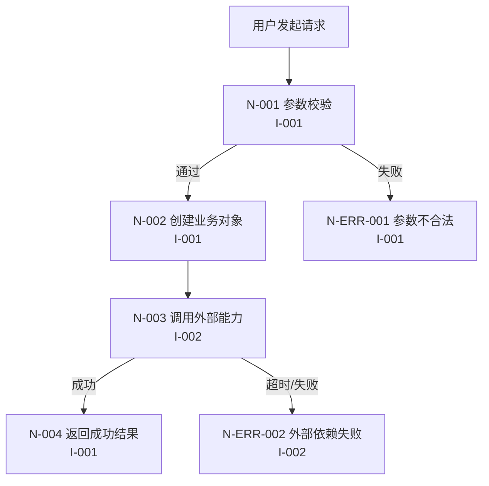

# Interaction Main Flow（交互主链路流程）: [FEATURE]

**Plan**: [plan.md](./plan.md) | **Date**: [DATE] | **Phase**: Phase 2 - UX Flow

---

## Overview（概述）

本文档用于固化本功能的主交互链路（MVP 可跑通路径），采用 Mermaid `flowchart` 表达用户步骤与系统交互。

- **契约主源（SSoT）**: `contracts/api.contract-table.md`
- **可选一致性参考**: `contracts/api.openapi.yaml`
- **下游消费方**: `research.md`（Phase 3）、`contracts/smoke-tests.md`（Phase 2）

### Success Criteria Check（门禁）

- [ ] 是否使用 Mermaid `flowchart` 覆盖核心用户路径与关键分支？
- [ ] 每个接口节点是否标注了 Interface ID（I-XXX）并引用关键 Field Specification？
- [ ] 是否包含至少 1 条成功主链路与 1 条关键失败链路？
- [ ] 节点 ID 是否可被 `smoke-tests.md` 双向追溯？

---

## 1. Node-to-Interface Mapping List（节点与接口映射清单）

| NodeID（节点ID） | NodeName（节点名称） | NodeType（节点类型） | Interface ID | KeyFields（关键字段） | Notes（说明） |
|--------|---------|---------|-------------|-----------------------------------------|------|
| N-001 | [输入参数校验] | Validation | I-001 | `userId`, `amount` | 前置合法性检查 |
| N-002 | [创建业务对象] | Domain | I-001 | `orderId`, `status` | 进入主交易流程 |
| N-003 | [调用外部能力] | External | I-002 | `channel`, `traceId` | 三方依赖交互 |
| N-004 | [返回成功结果] | Response | I-001 | `code`, `message`, `data` | 主链路成功结束 |
| N-ERR-001 | [参数不合法] | Error | I-001 | `code`, `message` | 关键失败分支 |

---

## 2. Main Interaction Flowchart（主交互流程图）（Mermaid flowchart）

---

## 3. Key Branch Notes（关键分支说明）

### 3.1 Successful Main Flow（成功主链路）

| PathID（路径ID） | NodeSequence（节点序列） | BusinessGoal（业务目标） | AcceptancePoints（验收要点） |
|--------|---------|---------|---------|
| P-HAPPY-001 | N-001 → N-002 → N-003 → N-004 | 主交易可跑通 | 返回 2xx；关键字段完整 |

### 3.2 Key Failure Flows（关键失败链路）

| PathID（路径ID） | NodeSequence（节点序列） | FailureType（失败类型） | ExpectedResult（期望结果） |
|--------|---------|---------|---------|
| P-FAIL-001 | N-001 → N-ERR-001 | 输入非法 | 4xx + 明确错误码 |
| P-FAIL-002 | N-001 → N-002 → N-003 → N-ERR-002 | 外部依赖失败 | 降级或可追踪失败响应 |

---

## 4. Traceability Links（追溯关系）（Flow ↔ Contract ↔ Smoke）

| FlowNodeOrPath（Flow节点/路径） | Interface ID | ContractFieldSource（Contract字段来源） | RelatedSmokeCaseID（对应SmokeCase ID） |
|---------------|-------------|------------------|---------------------|
| N-001 | I-001 | `userId`, `amount` | ST-001, ST-002 |
| N-003 | I-002 | `channel`, `traceId` | ST-003 |
| P-HAPPY-001 | I-001/I-002 | 关键字段组合 | ST-001 |
| P-FAIL-001 | I-001 | 错误码字段 | ST-002 |

---

**后续步骤**:
基于本流程节点与路径，进入 `contracts/smoke-tests.md` 生成最小可跑通的冒烟用例集合。
