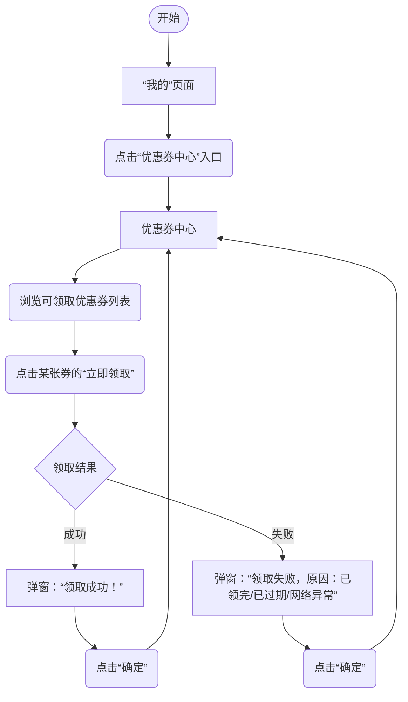
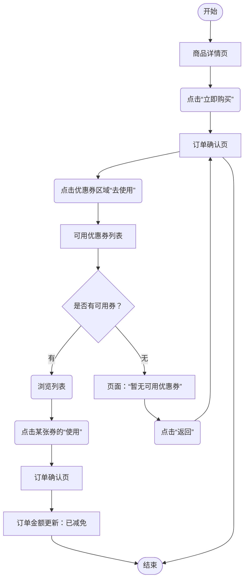

# 📄 用户交互流程：优惠券领取与使用

> **产品**：XX电商App  
> **功能**：优惠券中心  
> **版本**：v1.0  

---

## 1. 流程概述

用户可在**优惠券中心**领取优惠券，并在下单时使用。本文档仅描述**用户视角的操作步骤与界面反馈**，不涉及后端实现。

---

## 2. 用户交互流程图

### 2.1 图例

| 符号 | 含义 |
|:----:|:----|
| `[]` | 页面/界面 |
| `()` | 用户操作 |
| `{}` | 系统反馈/决策 |
| `-->` | 流程方向 |

### 2.2 领取优惠券流程

### 2.3 下单使用优惠券流程

---

## 3. 界面状态说明

| 界面 | 默认状态 | 异常状态 |
|:-----|:---------|:---------|
| 我的页面 | 显示用户信息 | 未登录：显示“点击登录” |
| 优惠券中心 | 可领取券列表 | 无券：空白页“暂无优惠券” |
| 订单确认页 | 显示商品+原价 | 无可用券：优惠券区显示“无可用优惠券” |
| 可用优惠券列表 | 当前订单可用券列表 | 无券：空白页“暂无可用优惠券” |

---

## 4. 异常场景

### 4.1 领取异常

| 场景 | 用户看到 | 后续操作 |
|:-----|:---------|:---------|
| 券已领完 | 弹窗：“来晚了，优惠券已抢完” | 点击确定，留在当前页 |
| 券已过期 | 弹窗：“该优惠券已过期” | 点击确定，留在当前页 |
| 网络异常 | 弹窗：“网络异常，请稍后重试” | 点击确定，可重试 |
| 已领取过 | 弹窗：“您已领取过该券” | 点击确定，按钮置灰 |

### 4.2 使用异常

| 场景 | 用户看到 | 后续操作 |
|:-----|:---------|:---------|
| 无可用券 | 列表页：“暂无可用优惠券” | 点击返回，回到订单页 |
| 券不可用（门槛不足） | 列表中该券置灰，不可点击 | 浏览其他券或返回 |
| 返回后优惠未生效 | 订单页金额未变 | 可重新进入列表页尝试 |

---

## 5. 交互元素明细

| 操作 | 所在界面 | 操作元素 | 触发结果 |
|:-----|:---------|:---------|:---------|
| 进入优惠券中心 | 我的页面 | “优惠券中心”入口 | 跳转到优惠券中心 |
| 领取优惠券 | 优惠券中心 | 券上的“立即领取” | 弹出领取结果 |
| 使用优惠券 | 可用优惠券列表 | 券上的“使用” | 返回订单页，金额更新 |
| 返回上一页 | 可用优惠券列表 | 左上角“返回” | 返回订单确认页 |

---