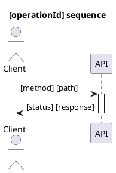
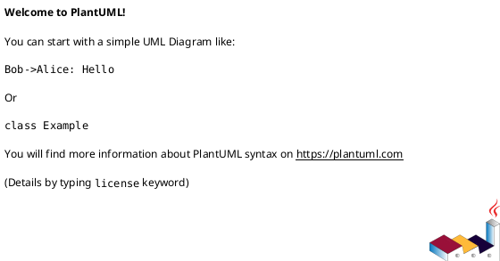

# Interface Detail: [operationId]

> **Scope**: This document is operation-scoped (one `operationId` only).
> It is design (not implementation) and must be grounded in repo evidence.

## 1. Interface Reference *(mandatory)*

| Field | Value |
| --- | --- |
| operationId | `[operationId]` |
| Method | `[GET|POST|PUT|PATCH|DELETE]` |
| Path | `[/path]` |
| Summary | `[summary]` |
| x-fr-ids | `[FR-###, ...]` |
| x-uc-ids (optional) | `[UC-###, ...]` |
| Auth / Security | `[e.g., bearerAuth / session / N/A]` |
| Request schema | `#/components/schemas/[RequestVO]` (or `N/A`) |
| Success response | `[200|201|204]` → `#/components/schemas/[ResponseVO]` (or `N/A`) |
| Error responses | `[4xx/5xx]` → `#/components/schemas/Error` (or project-specific) |

## 2. UDD Coverage (Key Path) *(mandatory)*

> Include **Key Path + System-backed** UDD items covered by this operation.
> If none: write `Key Path coverage: N/A` and explain why.

| UDD Item (Entity.field) | UC/Scenario (P1) | VO field path | Notes |
| --- | --- | --- | --- |
| `[Entity.field]` | `[UC-### / Scenario]` | `[#/components/schemas/.../properties/...]` | `[UI-local/derived/technical]` |

## 3. Evidence & Call Chain *(mandatory)*

> Call-chain drilldown. Every step MUST be marked `Existing` (verified) or `Planned/New code`.
> If the constitution defines an Architecture Evidence Index (SSOT) with `AEI-###`, any **Existing** boundary step MUST cite `AEI-###`.

| Step | Layer/Component | Evidence (file/symbol) | Status | Notes |
| --- | --- | --- | --- | --- |
| 1 | `[Router/Controller]` | `[path:line] :: [symbol]` | `Existing` | `[AEI-### if boundary]` |
| 2 | `[Service]` | `[path:line] :: [symbol]` | `Planned/New code` |  |
| 3 | `[Persistence/Remote]` | `[path:line] :: [symbol]` | `Planned/New code` |  |

## 4. Related Applications & Dependency Inventory *(mandatory)*

> List **all** dependencies used by this operation (internal modules, 2nd-party, 3rd-party, middleware, queues, caches).

| Dependency | Ownership | Direction | Protocol / Interface | Timeout | Retry | Failure / Degradation | Evidence |
| --- | --- | --- | --- | --- | --- | --- | --- |
| `[name]` | `[internal/2nd-party/3rd-party]` | `[inbound/outbound]` | `[HTTP/gRPC/DB/Queue/Cache]` | `[e.g., 1s]` | `[policy]` | `[behavior]` | `[path:line] / N/A` |

## 5. Sequence Diagram *(mandatory)*



## 6. Relevant Code Class Diagram *(optional)*



## 7. Core Algorithm Pseudocode *(optional)*

```text
[Keep business-critical logic only]
```

## 8. Change List *(mandatory)*

### 8.1 Resources (DB / config / infra)

| Area | Change | Evidence / Plan |
| --- | --- | --- |
| DB | `[migration/table/index]` | `[path] / Planned` |
| Config | `[env/feature flag]` | `[path] / Planned` |
| Infra | `[queue/topic/cache]` | `[path] / Planned` |

### 8.2 Source code modules/files

| File/Module | Change | Status |
| --- | --- | --- |
| `[path]` | `[what changes]` | `Planned/New code` |

### 8.3 Contract/schema deltas

| Item | Delta |
| --- | --- |
| OpenAPI | `[new operation / schema updates]` |

## 9. Performance Analysis *(mandatory)*

- **Latency budget**: `[e.g., p95 < 200ms]`
- **Critical path**: `[calls in order]`
- **External call budgets**: `[timeouts/retries/circuit breakers]`
- **Caching**: `[what/where/TTL]`
- **Concurrency**: `[hot paths / locking / idempotency]`
- **Failure modes**: `[dependency failures and degradation]`
- **Observability**: `[logs/metrics/traces; key fields]`

