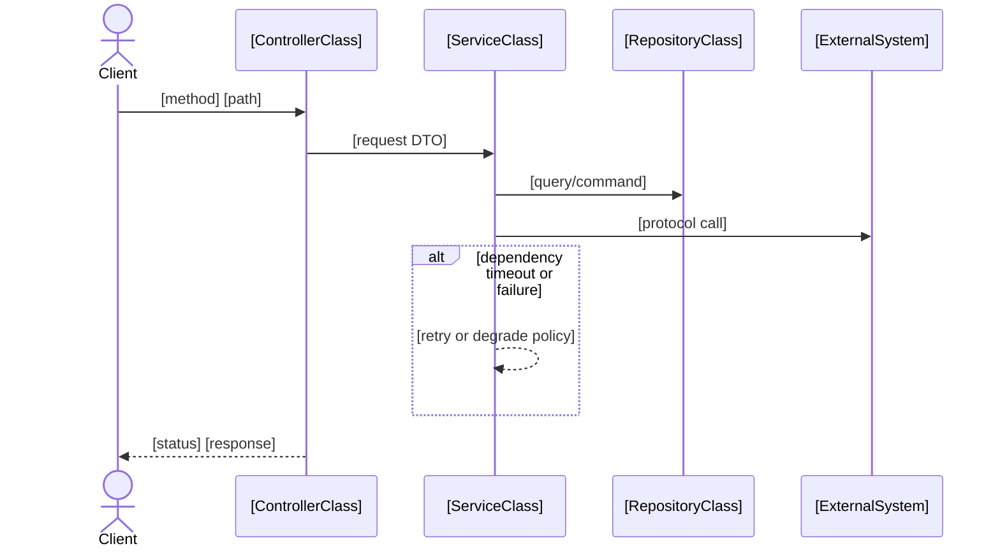

# Interface Detail: [operationId]

> **Scope**: This document is operation-scoped (one `operationId` only).
> It is design (not implementation) and must be grounded in repository evidence.

## 1. Interface Reference *(mandatory)*

| Field | Value |
| --- | --- |
| operationId | `[operationId]` |
| Method | `[GET|POST|PUT|PATCH|DELETE]` |
| Path | `[/path]` |
| OpenAPI operation ref | `contracts/openapi.yaml#/paths[/path]/[method]` |
| Summary | `[summary]` |
| Functional capability | `[one-line business capability]` |
| x-fr-ids | `[FR-###, ...]` |
| x-uc-ids (optional) | `[UC-###, ...]` |
| Auth / Security | `[e.g., bearerAuth / session / N/A]` |
| Request schema (VO) | `#/components/schemas/[RequestVO]` (or `N/A`) |
| Success response schema (VO) | `[200|201|204]` → `#/components/schemas/[ResponseVO]` (or `N/A`) |
| Persistence mapping (PO) | `[PO / table / aggregate refs]` |
| Error responses | `[4xx/5xx]` → `#/components/schemas/Error` (or project-specific) |

## 2. Evidence Baseline & Dependency Inventory *(mandatory)*

### 2.1 UDD Coverage (Key Path) *(mandatory)*

> Include **Key Path + System-backed** UDD items covered by this operation.
> If none: write `Key Path coverage: N/A` and explain why.

| UDD Item (Entity.field) | UC/Scenario (P1) | VO field path | Notes |
| --- | --- | --- | --- |
| `[Entity.field]` | `[UC-### / Scenario]` | `[#/components/schemas/.../properties/...]` | `[UI-local/derived/technical]` |

### 2.2 Evidence & Call Chain *(mandatory)*

Call-chain drilldown (operation-scoped). Each step marked `Existing` or `Planned/New code`.  
**SSOT Rule**: Any `Existing` boundary step MUST cite `AEI-###` (per constitution). Do not duplicate repository boundary index here.

| Step | Layer/Component | Evidence (file:symbol) | Status | Notes |
| --- | --- | --- | --- | --- |
| 1 | `[Router/Controller]` | `[path:line] :: [symbol]` | `Existing` | `[AEI-### if boundary]` |
| 2 | `[Service]` | `[path:line] :: [symbol]` | `Planned/New code` |  |

### 2.3 Dependency Inventory *(mandatory)*

> List **all** dependencies used by this operation (internal modules, 2nd-party, 3rd-party, middleware, queues, caches).

| Dependency | Ownership | Direction | Protocol / Interface | Timeout | Retry | Failure / Degradation | Evidence |
| --- | --- | --- | --- | --- | --- | --- | --- |
| `[name]` | `[internal/2nd-party/3rd-party]` | `[inbound/outbound]` | `[HTTP/gRPC/DB/Queue/Cache]` | `[e.g., 1s]` | `[policy]` | `[behavior]` | `[path:line] / N/A` |

## 3. Interface Detailed Design *(mandatory)*

### 3.1 Mandatory Interface Field Specification *(mandatory)*

#### 3.1.1 Protocol Definition *(mandatory)*

| URL | Method | Auth | Headers | Content-Type | Curl Example |
| --- | --- | --- | --- | --- | --- |
| `[/path]` | `[GET|POST|PUT|PATCH|DELETE]` | `[auth mode]` | `[key headers]` | `[json/form-data/etc.]` | ``curl -X ...`` |

#### 3.1.2 Request Field Specification *(mandatory)*

| Field path | Type | Required | Source (UDD/VO) | Validation rule | Notes |
| --- | --- | --- | --- | --- | --- |
| `[request.field]` | `[string/int/object/...]` | `[Y/N]` | `[Entity.field / schema path]` | `[constraint]` | `[default/nullable/etc.]` |

#### 3.1.3 Response Field Specification *(mandatory)*

| Field path | Type | Required | Source (PO/Domain) | Contract/display rule | Notes |
| --- | --- | --- | --- | --- | --- |
| `[response.field]` | `[string/int/object/...]` | `[Y/N]` | `[PO/model path]` | `[format/range/enum]` | `[fallback/nullable/etc.]` |

### 3.2 Sequence Diagram (Mermaid) *(mandatory)*

Must include ALL dependencies from Section 2.3.
Must be class-level for in-repository interactions (e.g., `OrderController`, `OrderService`, `OrderRepository`) instead of generic `API`.
Each in-repository participant/call MUST be traceable to Section 2.2 Evidence (`[path:line] :: [symbol]`).
If Section 2.3 defines timeout/retry/failure-degradation behavior, include at least one critical non-happy path.



### 3.3 UML Class Diagram (Mermaid) *(mandatory)*

Operation-scoped Mermaid `classDiagram`.
Must be consistent with Section 2.2 Evidence and Section 2.3 Dependency Inventory.
Include only in-repository code structures involved in this operation.
At minimum include class name, role/responsibility, key attributes or methods, and relevant relationships.

```mermaid
classDiagram
    class [ControllerClass] {
      +[handleMethod]([RequestDTO]) [ResponseDTO]
    }
    class [ServiceClass] {
      +[executeMethod]([Input]) [Output]
    }
    class [RepositoryClass] {
      +[queryOrSave]([Model]) [Result]
    }

    [ControllerClass] --> [ServiceClass] : uses
    [ServiceClass] --> [RepositoryClass] : depends on
```

### 3.4 Core Algorithm Pseudocode *(optional)*

```text
[Keep business-critical logic only]
```

### 3.5 File Change List *(mandatory)*

#### 3.5.1 Resources (DB / config / infra)

| Area | Change | Evidence / Plan |
| --- | --- | --- |
| DB | `[migration/table/index]` | `[path] / Planned` |
| Config | `[env/feature flag]` | `[path] / Planned` |
| Infra | `[queue/topic/cache]` | `[path] / Planned` |

#### 3.5.2 Source code modules/files

| File/Module | Change | Status |
| --- | --- | --- |
| `[path]` | `[what changes]` | `Planned/New code` |

#### 3.5.3 Contract/schema deltas

| Item | Delta |
| --- | --- |
| OpenAPI | `[new operation / schema updates]` |
| VO/PO mapping | `[field-level delta summary]` |

## 4. Performance Analysis *(mandatory)*

- **Latency budget**: `[e.g., p95 < 200ms]`
- **Critical path**: `[calls in order]`
- **External call budgets**: `[timeouts/retries/circuit breakers]`
- **Caching**: `[what/where/TTL]`
- **Concurrency**: `[hot paths / locking / idempotency]`
- **Failure modes**: `[dependency failures and degradation]`
- **Observability**: `[logs/metrics/traces; key fields]`
