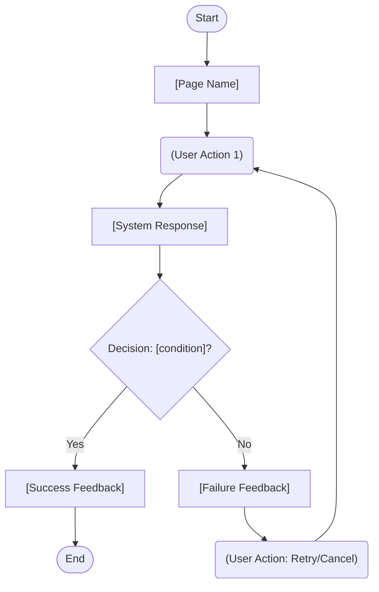

# Feature Specification: [FEATURE NAME]

**Feature Branch**: `[###-feature-name]`  
**Created**: [DATE]  
**Status**: Draft  
**Input**: User description: "$ARGUMENTS"

<!--
  ┌──────────────────────────────────────────────────────────────────────┐
  │                       文档结构说明（主模板）                           │
  │                                                                        │
  │  组织轴：以 Use Case (UC) 为颗粒度，先总览后明细                      │
  │                                                                        │
  │  § 1  全局上下文（mandatory）                                          │
  │       Actors / 系统边界 / 全局数据实体（Key Entities）                │
  │                                                                        │
  │  § 2  UC 总览（mandatory）         ← 所有 UC 的一览索引               │
  │                                                                        │
  │  § UC-xxx  UC 明细（每个 UC 一节，完整链路）                          │
  │       3.1  用户故事 & 验收场景      （mandatory）                     │
  │       3.2  用户交互流程             （optional）                      │
  │       3.3  功能需求 FR-xxx          （mandatory）                     │
  │       3.4  UI 元素定义              （optional — 前端功能时必填）     │
  │       3.5  组件-数据依赖总览        （optional — 推荐填写）           │
  │                                                                        │
  │  § N  全局验收标准（mandatory）                                        │
  │       成功指标 / 环境类 Edge Cases                                    │
  │                                                                        │
  │  ─── 受众导读 ───                                                     │
  │  产品评审 → § 1 · § 2 · 各UC 3.1 · 3.2 · 3.4                       │
  │  开发实现 → § 1 · § 2.2 · 各UC 3.3 · 3.4 · 3.5                    │
  │  测试验收 → 各UC 3.1 · § N                                          │
  └──────────────────────────────────────────────────────────────────────┘
-->

---

## § 1  Global Context *(mandatory)*

<!--
  此节声明跨所有 UC 共享的全局信息：参与者、系统边界、数据实体。
  每个 UC 的具体内容在各自的 § UC-xxx 节中展开，此处不重复描述。
-->

### 1.1  Actors

<!--
  列举所有参与者，类型三选一：Human / System / Timer
  每个 Actor 必须说明其在本 Spec 范围内的权限与职责，不描述系统外行为。

  示例：
  | 普通用户   | Human  | 领取、使用优惠券；查看自己的券列表  | 需登录 |
  | 运营人员   | Human  | 创建、配置、停用优惠券活动          | 后台权限 |
  | 订单系统   | System | 校验券合法性；扣减券库存             | 内部服务调用 |
-->

| Actor | Type | Permissions & Responsibilities (within this Spec) | Notes |
|-------|------|--------------------------------------------------|------|
| [Actor Name] | Human / System / Timer | [Description] | [Login requirements, permission level, etc.] |
| [Actor Name] | Human | [Description] | |
| [Actor Name] | System | [Description] | |

### 1.2  System Boundary

**In Scope**:

- [Scope item 1]
- [Scope item 2]

**Out of Scope (note ownership)**:

- [Out-of-scope item → owned by which Spec or future roadmap]
- [Out-of-scope item → owned by which Spec or future roadmap]

### 1.3  Key Entities

<!--
  Key Entities 是【数据层单一真相】。

  在产品设计阶段即可定义到“概念模型”粒度：实体、字段语义、口径（怎么算/取值规则）、边界值。
  不要求在此阶段写技术实现细节（如 DB 表结构、索引、分区、缓存方案）。
  接口与存储等实现细节（如 API endpoint、请求/响应字段、重试策略）后移到下游 plan/design 阶段。

  UI 是 Key Entities 的“投影/操作面”：
  - UI 负责呈现与操作（用户看见什么、能做什么）；
  - Key Entities 负责口径与语义（数据代表什么、怎么算）；
  - UI 的“口径”优先通过 `→ ref: [EntityName].[fieldName]` 引用 Key Entities，避免同一口径多处重复定义；
    UI 仅补充展示层差异（格式化、四舍五入、空值文案、颜色/标签规则等）。

  ⚠️  各 UC 明细中 UI 元素的"口径"字段通过 "→ ref: [EntityName].[fieldName]"
      引用此处定义，不在 UC 层重复定义相同口径，只补充展示层有差异的部分。

  有生命周期（多状态）的实体，在 § 2.2「全局状态机总览」中统一声明。
  有状态机的实体在此处用 *(→ 见 § 2.2 状态机)* 标注。
-->

- **[Entity 1]**：[Business meaning, key attributes; no implementation details]
- **[Entity 2]**：[Business meaning, relationship to other entities] *(→ see § 2.2 State Machine)*
- **[Entity 3]**：[Business meaning]

---

## § 2  UC Overview *(mandatory)*

<!--
  所有 Use Case 的索引一览。每行对应一个可追溯到明细节的用例。

  关系类型说明：
  - Primary      ：主用例，直接由 Actor 发起
  - <<include>>  ：被其他 UC 强制调用（每次必走）
  - <<extend>>   ：条件触发，扩展其他 UC 的行为

  Priority 与 User Story 优先级对齐（P1 / P2 / P3）。
-->

| UC ID | Use Case Description | Primary Actor | Relationship Type | Priority | Details |
|-------|----------------------|---------------|-------------------|----------|---------|
| UC-001 | [Primary use case, e.g., user claims coupon] | [Actor] | Primary | P1 | [→ § UC-001](#-uc-001-use-case-name) |
| UC-002 | [e.g., verify eligibility] | System | `<<include>>` UC-001 | P1 | [→ § UC-002](#-uc-002-use-case-name) |
| UC-003 | [e.g., send claim success notification] | System | `<<extend>>` UC-001 | P2 | [→ § UC-003](#-uc-003-use-case-name) |

### 2.1  Functional Requirements Index (FR Index)

<!--
  目的：在进入各 UC 明细前，先给出“功能需求（FR）”的跨 UC 索引，便于范围裁剪与评审对齐。

  ⚠️  重要：FR 编号通常在 UC 内局部编号（每个 UC 都可能有 FR-001）。
      因此本索引必须同时包含 UC ID + FR ID，避免跨 UC 冲突。

  明细定位规则：
  - FR 的详细内容写在对应 UC 的 “3.3 功能需求（Functional Requirements）” 小节；
  - 本索引只给“一句话能力声明 + 链接导航”，不重复长描述。
-->

| UC ID | FR ID | Capability Statement (short) | Level | ref: Scenario | Details |
|------|------|------------------------------|------|--------------|---------|
| UC-001 | FR-001 | [One-line system capability] | MUST / SHOULD / MAY | S1 | [→ § UC-001 (see 3.3)](#-uc-001-use-case-name) |
| UC-001 | FR-002 | [One-line system capability] | MUST | S1, S2 | [→ § UC-001 (see 3.3)](#-uc-001-use-case-name) |
| UC-002 | FR-001 | [One-line system capability] | MUST | S1 | [→ § UC-002 (see 3.3)](#-uc-002-use-case-name) |
| UC-003 | FR-001 | [One-line system capability] | SHOULD | S2 | [→ § UC-003 (see 3.3)](#-uc-003-use-case-name) |

### 2.2  Global State Machine Overview *(optional — include when entities have lifecycle and/or cross-UC transitions)*

<!--
  目的：统一声明“跨多个 UC 的实体生命周期”。

  为什么放总览：
  - 同一实体常被多个 UC 触发状态变化；
  - 若分散在各 UC 内，容易出现重复、冲突、漏转移。

  颗粒度建议（Spec 阶段）：
  - 以“业务上可观察/可验收”的状态与转换为单位；
  - 不是每一行代码、每一次内部中间事件都要写；
  - 每条转换必须能追溯到至少一个 UC 的 FR（或场景 Sx）。

  建议规则：
  1) 状态数保持最小完备（通常 4~8 个）
  2) 每条转换可被验证（Given/When/Then 能落地）
  3) 只写业务有意义的 Guard，不写实现细节（SQL/锁实现）
-->

#### [Entity Name] State Machine *(ref: § 1.3 → [Entity Name])*

**State Enumeration** (must be exhaustive; no missing intermediate states, each item requires business meaning):

| State | Business Meaning | Initial | Terminal |
|-------|------------------|:-------:|:--------:|
| [STATE_A] | [e.g., created, not yet processed] | ✅ | ❌ |
| [STATE_B] | [e.g., processing, awaiting response] | ❌ | ❌ |
| [STATE_C] | [e.g., completed] | ❌ | ✅ |
| [STATE_ERR] | [e.g., failed, needs intervention] | ❌ | ✅ |

**Transition Matrix (cross-UC)**:

| From State | Event (Trigger) | Guard (Condition) | To State | Triggering UC | ref: FR/Scenario |
|-----------|------------------|------------------|---------|--------------|-----------------|
| [STATE_A] | `[event]` | [e.g., inventory > 0] | [STATE_B] | UC-001 | FR-001 / S1 |
| [STATE_B] | `[event]` | [condition] | [STATE_C] | UC-003 | FR-002 / S2 |
| [STATE_B] | `[event]` | [e.g., timeout > 30min] | [STATE_ERR] | UC-004 | FR-001 / S3 |

**Forbidden Transitions** (state constraints, equivalent to state-class edge cases):

- `[STATE_C] → *`: Terminal state; no further transitions allowed
- `[STATE_A] → [STATE_C]`: Must pass through STATE_B; no direct jump to terminal
- [Other forbidden transitions...]

**Concurrency Rules**:

- [Can the same entity be triggered by multiple events concurrently?]
- [Conflict resolution strategy: optimistic lock / pessimistic lock / queue (strategy only, no implementation details)]

---

## § UC-001: [Use Case Name] *(Priority: P1)*

<!--
  每个 UC 明细节包含该 UC 的完整纵向链路：
  3.1 用户故事 & 验收 → 3.2 交互流程 → 3.3 功能需求 → 3.4 UI 定义 → 3.5 组件-数据依赖

  读者在此一节内可获取该 UC 从业务意图到实现契约的所有信息，无需跳转其他章节。
  可选小节（3.2 / 3.4 / 3.5）按实际情况决定是否填写，不需要时直接删除。

  追溯原则（用于 plan/tasks）：
  - UI/组件与数据口径尽量通过 `→ ref: Entity.field` 引用 § 1.3 Key Entities
  - 组件-数据依赖（3.5）用于承接到 plan 的实现映射与 tasks 的任务拆解
-->

### 3.1  User Story & Acceptance Scenarios

<!--
  描述该 UC 对应的用户价值和可验收条件。

  ⚠️  Acceptance Scenarios = "如何验证该 UC 已正确实现（单条路径的输入输出断言）"
      与 3.2 交互流程的关系：Scenario 验证单条路径；Flow 描述所有路径的连接结构。
      Flow 中的每个分支节点建议标注对应的 Scenario 编号，形成双向追溯。
-->

**User Story**: As a **[Actor]**, I want to **[goal]**, so that **[value]**.

**Why this priority**: [Explain why this UC is P1 and the impact of not implementing it]

**Independent Test**: [If implemented alone, how can this UC be tested and what minimal value is delivered?]

**Acceptance Scenarios**:

| # | Given (Precondition) | When (Trigger) | Then (Expected Result) |
|---|----------------------|----------------|------------------------|
| S1 | [Initial state] | [User or system action] | [Expected output or state change] |
| S2 | [Initial state] | [Action] | [Expected result] |
| S3 (Exception) | [e.g., inventory is 0] | [Same action] | [Exception handling result] |

---

### 3.2  User Interaction Flow *(mandatory — include when UC involves multi-step or branching interactions)*

<!--
  描述该 UC 中用户与系统交互的完整流程结构，包括所有分支和异常路径。

  图例约定（与 user_template/交互流程图.md 一致）：
  [ ] 页面 / 界面状态    ( ) 用户操作    { } 系统决策 / 条件判断

  Traceability（双向追溯）：
  - 每个系统响应节点 → 标注 ref: FR-xxx（见本 UC 3.3）
  - 每条异常路径     → 标注 ref: EC-xxx（见 § N 全局 Edge Cases）
  - 分支节点         → 标注 ref: Sn（见本 UC 3.1 验收场景编号）
-->

**Preconditions**:

| Dimension | State Description |
|----------|-------------------|
| User State | [e.g., logged in with standard user permissions] |
| System State | [e.g., coupon inventory > 0 and campaign is active] |
| Data State | [e.g., the user has not claimed this coupon] |

**Main Flow**:

> **Text Version** (for environments without Mermaid rendering):
>
> 1. User opens **[Page Name]**
> 2. User performs **[Action]**
> 3. System **[Response]** *(ref: FR-001)*
>    - **Branch A** (if [condition], ref: S1) → Step 5
>    - **Branch B** (if [condition], ref: S3) → Exception Path E1
> 4. User confirms, system **[Final Response]** *(ref: FR-002)*
> 5. Flow ends; postconditions satisfied

**Exception Paths**:

| Exception ID | Trigger Step | Trigger Condition | System Response | User Perception (UI Feedback) | ref |
|-------------|--------------|------------------|-----------------|-------------------------------|-----|
| E1 | Step 3 | [e.g., inventory is 0] | [System action] | [e.g., modal "Too late, all claimed"] | EC-001 |
| E2 | Step 4 | [e.g., network timeout] | [System action] | [e.g., modal "Network error, please retry"] | EC-002 |

**Postconditions**:

| Outcome | Final System State |
|---------|--------------------|
| Main flow success | [e.g., user wallet gains 1 coupon, inventory -1] |
| Exception E1 | [e.g., no data change, state unchanged] |
| Exception E2 | [e.g., action not completed, user can retry] |

---

### 3.3  Functional Requirements

<!--
  FR = "系统能做什么"（能力声明），技术无关、行为导向。

  ⚠️  每条 FR 应能追溯到本 UC 3.1 中至少一条验收场景（S1 / S2 / S3 ...）；
      3.2 流程中每个系统响应节点应引用此处的 FR ID。

  优先级：MUST（必须实现）/ SHOULD（应当实现）/ MAY（可选实现）
-->

- **FR-001**: System MUST [Capability statement] *(→ ref: S1)*
- **FR-002**: System MUST [Capability statement] *(→ ref: S1, S2)*
- **FR-003**: System SHOULD [Capability statement: async or non-core behavior] *(→ ref: S2)*
- **FR-004**: System MUST [Data or record requirement]

*Pending Clarification Example (delete when filled):*

- **FR-005**: System MUST [NEEDS CLARIFICATION: rule not defined, e.g., max per user? max per day?]

---

### 3.4  UI Element Definitions *(required for frontend features, optional otherwise)*

<!--
  提供该 UC 对应功能点的前端实现契约，精确到组件级别。

  UI 是 Key Entities 的“投影/操作面”：UI 描述用户可见与可操作的界面契约；
  数据语义与口径以 § 1.3 Key Entities 为准，UI 通过 `→ ref:` 引用并仅补充展示层差异。

  ⚠️  【内涵】与【口径】是必填项，不允许留空：
      内涵（What）：该字段/控件的业务语义，回答"这是什么、代表什么含义"
      口径（How）：  取值规则、数据来源、格式约束、边界值、精度

  口径去重规则：
  - 与 § 1.3 Key Entities 一致 → 使用 "→ ref: [Entity].[field]" 引用，只补充展示层差异

  组件 ID 命名规则：
  - 按钮：btn-[action]-[object]  例：btn-claim-coupon
  - 输入：input-[fieldname]      例：input-search-keyword
  - 列表：list-[object]          例：list-available-coupon
  - 弹窗：modal-[action]         例：modal-confirm-claim
  - 标签：badge-[status]         例：badge-coupon-status
-->

#### Page / View Info

| Item | Content |
|------|---------|
| Page Title | [e.g., Coupon Center] |
| Route Path | `/[path/to/page]` |
| Entry Path | [e.g., "Me" Tab → "Coupon Center" entry] |
| Access Requirements | [e.g., logged-in users, no role restriction] |

---

#### Component: `[component-id]`

**Type**: Button / Input / Select / Table / List / Modal / Badge / Text / ...

**Display Copy**:

| State | Exact Copy |
|------|------------|
| Default | `"[e.g., Claim Now]"` |
| Loading | `"[e.g., Claiming...]"` |
| Empty | `"[e.g., No available coupons]"` |
| Error | `"[e.g., Claim failed, please retry]"` |

**Meaning**: [**Required**. Answer "what is this" with precise business meaning]

> ✅ Good: "This button triggers claiming the current coupon; on success the coupon is assigned to the logged-in user's wallet and inventory is decremented."
> ❌ Bad: "A claim button"

**Definition**: [**Required**. Value rules, data source, format constraints, boundaries]

> When consistent with § 1.3 Key Entities: `→ ref: [Entity].[field]`, only add display-layer differences here
>
> ✅ Good: "→ ref: Coupon.expireTime; display format `MMM DD HH:mm`, hide year; show red text 'Expired' after expiry"

**State Rules**:

| State | Trigger Condition | Visual Treatment | Interaction |
|------|-------------------|------------------|-------------|
| enabled  | [e.g., inventory > 0 and user has not claimed] | [e.g., primary color, clickable] | [e.g., click to claim] |
| disabled | [e.g., user already claimed] | [e.g., gray, not clickable] | No response |
| loading  | [e.g., request in progress] | [e.g., spinner + copy] | Prevent duplicate clicks |
| error    | [e.g., request failed] | [e.g., red error text] | Allow retry |
| empty    | [Fill when applicable] | [Placeholder copy] | [Guided action] |

**Triggered Behavior**: [What happens after the user action] *(ref: FR-001)*

---

#### Component: `[component-id-2]`

> *(Continue adding components using the format above)*

---

### 3.5  Component-Data Dependency Overview *(optional — recommended when generating plan/tasks)*

<!--
  目的：把“组件（UI/交互点）→ 数据项 → Entity.field → 更新触发事件”固化为可引用锚点，
  作为 plan 与 tasks 的上游输入，避免实现任务无法追溯。

  填写规则：
  - 每行必须能追溯到至少一个 FR（3.3）或验收场景（3.1）
  - 数据项口径优先使用 `→ ref: [Entity].[field]`
  - 更新触发事件用业务语义描述（例：用户点击领取；系统超时重试完成），不写技术实现
-->

| Component ID | Dependent Data (user-perceived) | Data Source (business) | Update Trigger | ref: Entity.field | ref: FR/Scenario |
|---|---|---|---|---|---|
| [component-id] | [item] | [source] | [trigger] | → ref: [Entity].[field] | FR-001 / S1 |

---

## § UC-002: [Use Case Name] *(Priority: P1)*

<!--
  按 § UC-001 的结构完整填写，包含 3.1 ~ 3.5。
  可选小节（3.2 / 3.4 / 3.5）按实际情况决定是否填写，不需要时直接删除。
-->

### 3.1  User Story & Acceptance Scenarios

> *(Fill using § UC-001 3.1 format)*

### 3.2  User Interaction Flow *(optional)*

> *(Fill using § UC-001 3.2 format; delete if not multi-step or branching)*

### 3.3  Functional Requirements

> *(Fill using § UC-001 3.3 format)*

### 3.4  UI Element Definitions *(optional / required for frontend)*

> *(Fill using § UC-001 3.4 format; delete if no frontend interaction)*

### 3.5  Component-Data Dependency Overview *(optional — recommended when generating plan/tasks)*

> *(Fill using § UC-001 3.5 format; delete if no component/data dependencies)*

---

## § UC-003: [Use Case Name] *(Priority: P2)*

> *(Fill using the full § UC-001 structure)*

---

## § N  Global Acceptance Criteria *(mandatory)*

<!--
  此节收录跨 UC 共享的验收指标和环境类异常，与各 UC 明细不重复。
-->

### N.1  Success Criteria

<!--
  ✅ 正确："用户在 2 分钟内完成领券操作"
  ✅ 正确："系统支持 1000 个并发领券请求无降级"
  ❌ 错误："使用 Redis 做库存扣减"   ← 技术实现，不属于此处
  ❌ 错误："调用 POST /api/claim"   ← 接口约定，不属于此处
-->

- **SC-001**: [Quantifiable metric, e.g., "End-to-end claim flow < 2s (P95)"]
- **SC-002**: [Concurrency metric, e.g., "System supports 1000 QPS claim requests without degradation"]
- **SC-003**: [Success rate metric, e.g., "Main flow completion rate ≥ 95%"]
- **SC-004**: [Business metric, e.g., "Redemption rate ≥ 40% within 30 days after claim"]

### N.2  Environment Edge Cases

<!--
  仅填写【环境类异常】（与具体状态实体无关的系统级异常）：
  ✅ 网络超时 / 断连
  ✅ 第三方服务不可用
  ✅ 并发冲突（乐观锁失败）
  ✅ 权限校验失败

  以下内容不属于此处，已在 § 2.2 全局状态机总览的“禁止转换清单”中定义：
  ❌ "已使用的券不能再次领取"   ← 状态转换约束
  ❌ "草稿状态才允许编辑"       ← 状态转换约束

  判断方法：删掉该实体，这条规则还成立吗？
  成立（如"网络超时"与实体无关）→ 环境类，写在此处
  不成立（如"已完成的订单"删掉就没意义）→ 状态类，写在 § 2.2 全局状态机总览

  ID 格式：EC-001, EC-002 ...
-->

- **EC-001**: [e.g., "Downstream coupon service timeout (> 3s) returns friendly message and logs, no inventory deduction"]
- **EC-002**: [e.g., "Optimistic lock conflict due to concurrent claims triggers one retry; beyond that returns failure"]
- **EC-003**: [e.g., "User token expired; redirect to login and preserve claim intent (redirect back)"]
