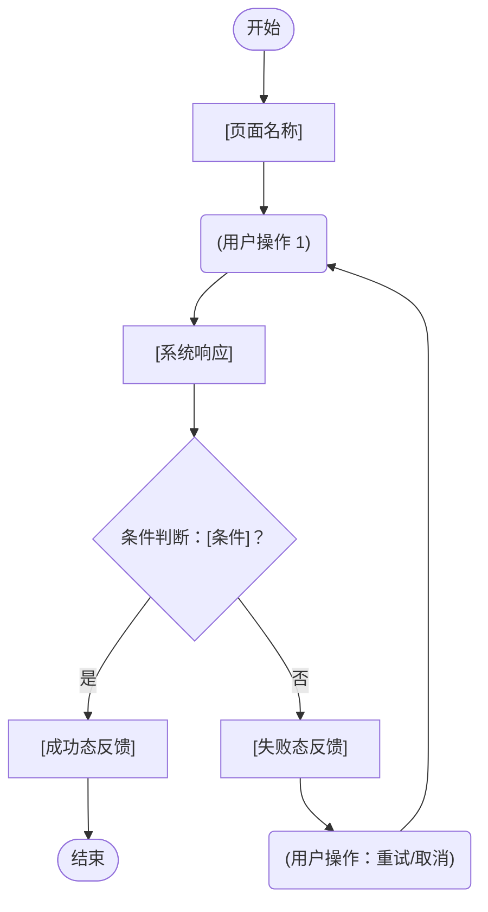

# Feature Specification: [FEATURE NAME]

**Feature Branch**: `[###-feature-name]`  
**Created**: [DATE]  
**Status**: Draft  
**Input**: User description: "$ARGUMENTS"

<!--
  ┌──────────────────────────────────────────────────────────────────────┐
  │                       文档结构说明（主模板）                           │
  │                                                                        │
  │  组织轴：以 Use Case (UC) 为颗粒度，先总览后明细                      │
  │                                                                        │
  │  § 1  全局上下文（mandatory）                                          │
  │       Actors / 系统边界 / 全局数据实体（Key Entities）                │
  │                                                                        │
  │  § 2  UC 总览（mandatory）         ← 所有 UC 的一览索引               │
  │                                                                        │
  │  § UC-xxx  UC 明细（每个 UC 一节，完整链路）                          │
  │       3.1  用户故事 & 验收场景      （mandatory）                     │
  │       3.2  用户交互流程             （optional）                      │
  │       3.3  功能需求 FR-xxx          （mandatory）                     │
  │       3.4  UI 元素定义              （optional — 前端功能时必填）     │
  │       3.5  组件-数据依赖总览        （optional — 推荐填写）           │
  │                                                                        │
  │  § N  全局验收标准（mandatory）                                        │
  │       成功指标 / 环境类 Edge Cases                                    │
  │                                                                        │
  │  ─── 受众导读 ───                                                     │
  │  产品评审 → § 1 · § 2 · 各UC 3.1 · 3.2 · 3.4                       │
  │  开发实现 → § 1 · § 2.2 · 各UC 3.3 · 3.4 · 3.5                    │
  │  测试验收 → 各UC 3.1 · § N                                          │
  └──────────────────────────────────────────────────────────────────────┘
-->

---

## § 1  全局上下文 *(mandatory)*

<!--
  此节声明跨所有 UC 共享的全局信息：参与者、系统边界、数据实体。
  每个 UC 的具体内容在各自的 § UC-xxx 节中展开，此处不重复描述。
-->

### 1.1  参与者（Actors）

<!--
  列举所有参与者，类型三选一：Human / System / Timer
  每个 Actor 必须说明其在本 Spec 范围内的权限与职责，不描述系统外行为。

  示例：
  | 普通用户   | Human  | 领取、使用优惠券；查看自己的券列表  | 需登录 |
  | 运营人员   | Human  | 创建、配置、停用优惠券活动          | 后台权限 |
  | 订单系统   | System | 校验券合法性；扣减券库存             | 内部服务调用 |
-->

| Actor | 类型 | 权限与职责（本 Spec 范围内） | 备注 |
|-------|------|--------------------------|------|
| [Actor Name] | Human / System / Timer | [描述] | [登录要求、权限级别等] |
| [Actor Name] | Human | [描述] | |
| [Actor Name] | System | [描述] | |

### 1.2  系统边界（System Boundary）

**In Scope（本 Spec 覆盖）**：

- [功能边界 1]
- [功能边界 2]

**Out of Scope（本 Spec 不覆盖，说明归属）**：

- [边界外内容 → 属于哪个 Spec 或后续规划]
- [边界外内容 → 属于哪个 Spec 或后续规划]

### 1.3  全局数据实体（Key Entities）

<!--
  Key Entities 是【数据层单一真相】。

  在产品设计阶段即可定义到“概念模型”粒度：实体、字段语义、口径（怎么算/取值规则）、边界值。
  不要求在此阶段写技术实现细节（如 DB 表结构、索引、分区、缓存方案）。
  接口与存储等实现细节（如 API endpoint、请求/响应字段、重试策略）后移到下游 plan/design 阶段。

  UI 是 Key Entities 的“投影/操作面”：
  - UI 负责呈现与操作（用户看见什么、能做什么）；
  - Key Entities 负责口径与语义（数据代表什么、怎么算）；
  - UI 的“口径”优先通过 `→ ref: [EntityName].[fieldName]` 引用 Key Entities，避免同一口径多处重复定义；
    UI 仅补充展示层差异（格式化、四舍五入、空值文案、颜色/标签规则等）。

  ⚠️  各 UC 明细中 UI 元素的"口径"字段通过 "→ ref: [EntityName].[fieldName]"
      引用此处定义，不在 UC 层重复定义相同口径，只补充展示层有差异的部分。

  有生命周期（多状态）的实体，在 § 2.2「全局状态机总览」中统一声明。
  有状态机的实体在此处用 *(→ 见 § 2.2 状态机)* 标注。
-->

- **[Entity 1]**：[业务含义，关键属性，不描述实现细节]
- **[Entity 2]**：[业务含义，与其他实体的关系] *(→ 见 § 2.2 状态机)*
- **[Entity 3]**：[业务含义]

---

## § 2  UC 总览 *(mandatory)*

<!--
  所有 Use Case 的索引一览。每行对应一个可追溯到明细节的用例。

  关系类型说明：
  - Primary      ：主用例，直接由 Actor 发起
  - <<include>>  ：被其他 UC 强制调用（每次必走）
  - <<extend>>   ：条件触发，扩展其他 UC 的行为

  Priority 与 User Story 优先级对齐（P1 / P2 / P3）。
-->

| UC ID | 用例描述 | 主 Actor | 关系类型 | 优先级 | 明细 |
|-------|---------|---------|---------|-------|-----|
| UC-001 | [主用例，例：用户领取优惠券] | [Actor] | Primary | P1 | [→ § UC-001](#-uc-001用例名称) |
| UC-002 | [例：验证领取资格] | System | `<<include>>` UC-001 | P1 | [→ § UC-002](#-uc-002用例名称) |
| UC-003 | [例：发送领取成功通知] | System | `<<extend>>` UC-001 | P2 | [→ § UC-003](#-uc-003用例名称) |

### 2.1  功能需求清单（FR Index）

<!--
  目的：在进入各 UC 明细前，先给出“功能需求（FR）”的跨 UC 索引，便于范围裁剪与评审对齐。

  ⚠️  重要：FR 编号通常在 UC 内局部编号（每个 UC 都可能有 FR-001）。
      因此本索引必须同时包含 UC ID + FR ID，避免跨 UC 冲突。

  明细定位规则：
  - FR 的详细内容写在对应 UC 的 “3.3 功能需求（Functional Requirements）” 小节；
  - 本索引只给“一句话能力声明 + 链接导航”，不重复长描述。
-->

| UC ID | FR ID | 能力声明（简述） | 级别 | ref: 场景 | 明细 |
|------|------|------------------|------|----------|------|
| UC-001 | FR-001 | [一句话描述系统能力] | MUST / SHOULD / MAY | S1 | [→ § UC-001（见 3.3）](#-uc-001用例名称) |
| UC-001 | FR-002 | [一句话描述系统能力] | MUST | S1, S2 | [→ § UC-001（见 3.3）](#-uc-001用例名称) |
| UC-002 | FR-001 | [一句话描述系统能力] | MUST | S1 | [→ § UC-002（见 3.3）](#-uc-002用例名称) |
| UC-003 | FR-001 | [一句话描述系统能力] | SHOULD | S2 | [→ § UC-003（见 3.3）](#-uc-003用例名称) |

### 2.2  全局状态机总览 *(optional — include when entities have lifecycle and/or cross-UC transitions)*

<!--
  目的：统一声明“跨多个 UC 的实体生命周期”。

  为什么放总览：
  - 同一实体常被多个 UC 触发状态变化；
  - 若分散在各 UC 内，容易出现重复、冲突、漏转移。

  颗粒度建议（Spec 阶段）：
  - 以“业务上可观察/可验收”的状态与转换为单位；
  - 不是每一行代码、每一次内部中间事件都要写；
  - 每条转换必须能追溯到至少一个 UC 的 FR（或场景 Sx）。

  建议规则：
  1) 状态数保持最小完备（通常 4~8 个）
  2) 每条转换可被验证（Given/When/Then 能落地）
  3) 只写业务有意义的 Guard，不写实现细节（SQL/锁实现）
-->

#### [Entity Name] 状态机 *(ref: § 1.3 → [Entity Name])*

**状态枚举**（必须穷举，不遗漏中间态，每项业务语义必填）：

| State | 业务语义 | 初始 | 终止 |
|-------|---------|:---:|:---:|
| [STATE_A] | [例：已创建，尚未处理] | ✅ | ❌ |
| [STATE_B] | [例：处理中，等待响应] | ❌ | ❌ |
| [STATE_C] | [例：已完成] | ❌ | ✅ |
| [STATE_ERR] | [例：处理失败，需介入] | ❌ | ✅ |

**转换矩阵（跨 UC）**：

| From State | Event（触发事件） | Guard（守卫条件） | To State | 触发 UC | ref: FR/场景 |
|-----------|----------------|----------------|---------|--------|------------|
| [STATE_A] | `[event]` | [例：库存 > 0] | [STATE_B] | UC-001 | FR-001 / S1 |
| [STATE_B] | `[event]` | [条件] | [STATE_C] | UC-003 | FR-002 / S2 |
| [STATE_B] | `[event]` | [例：超时 > 30min] | [STATE_ERR] | UC-004 | FR-001 / S3 |

**禁止转换清单**（状态类约束集中声明，等同于状态类 Edge Cases）：

- `[STATE_C] → *`：终止状态，不允许任何后续转换
- `[STATE_A] → [STATE_C]`：必须经过 STATE_B，不允许跳跃直达终态
- [其他禁止转换...]

**并发规则**：

- [是否允许同一实体被并发触发多个 Event？]
- [冲突解决策略：乐观锁 / 悲观锁 / 队列（仅写策略，不写实现细节）]

---

## § UC-001：[用例名称] *(Priority: P1)*

<!--
  每个 UC 明细节包含该 UC 的完整纵向链路：
  3.1 用户故事 & 验收 → 3.2 交互流程 → 3.3 功能需求 → 3.4 UI 定义 → 3.5 组件-数据依赖

  读者在此一节内可获取该 UC 从业务意图到实现契约的所有信息，无需跳转其他章节。
  可选小节（3.2 / 3.4 / 3.5）按实际情况决定是否填写，不需要时直接删除。

  追溯原则（用于 plan/tasks）：
  - UI/组件与数据口径尽量通过 `→ ref: Entity.field` 引用 § 1.3 Key Entities
  - 组件-数据依赖（3.5）用于承接到 plan 的实现映射与 tasks 的任务拆解
-->

### 3.1  用户故事 & 验收场景

<!--
  描述该 UC 对应的用户价值和可验收条件。

  ⚠️  Acceptance Scenarios = "如何验证该 UC 已正确实现（单条路径的输入输出断言）"
      与 3.2 交互流程的关系：Scenario 验证单条路径；Flow 描述所有路径的连接结构。
      Flow 中的每个分支节点建议标注对应的 Scenario 编号，形成双向追溯。
-->

**用户故事**：As a **[Actor]**, I want to **[目标]**, so that **[价值]**.

**Why this priority**：[说明为什么这个 UC 是 P1，不实现的影响是什么]

**Independent Test**：[单独实现此 UC 后，如何独立测试，能向用户交付什么最小价值]

**验收场景**：

| # | Given（前置状态） | When（触发操作） | Then（预期结果） |
|---|-----------------|----------------|----------------|
| S1 | [初始状态] | [用户或系统操作] | [期望输出或状态变化] |
| S2 | [初始状态] | [操作] | [期望结果] |
| S3（异常） | [例：库存为 0] | [同一操作] | [异常处理结果] |

---

### 3.2  用户交互流程 *(mandatory — include when UC involves multi-step or branching interactions)*

<!--
  描述该 UC 中用户与系统交互的完整流程结构，包括所有分支和异常路径。

  图例约定（与 user_template/交互流程图.md 一致）：
  [ ] 页面 / 界面状态    ( ) 用户操作    { } 系统决策 / 条件判断

  Traceability（双向追溯）：
  - 每个系统响应节点 → 标注 ref: FR-xxx（见本 UC 3.3）
  - 每条异常路径     → 标注 ref: EC-xxx（见 § N 全局 Edge Cases）
  - 分支节点         → 标注 ref: Sn（见本 UC 3.1 验收场景编号）
-->

**前置条件**：

| 维度 | 状态描述 |
|------|---------|
| 用户状态 | [例：已登录，拥有普通用户权限] |
| 系统状态 | [例：优惠券库存 > 0，活动有效期内] |
| 数据状态 | [例：该用户未领取过此券] |

**主流程**：

> **文字版**（供不支持 Mermaid 渲染的环境）：
>
> 1. 用户进入 **[页面名称]**
> 2. 用户执行 **[操作]**
> 3. 系统 **[响应]** *(ref: FR-001)*
>    - **分支 A**（若 [条件]，ref: S1）→ 步骤 5
>    - **分支 B**（若 [条件]，ref: S3）→ 异常路径 E1
> 4. 用户确认，系统 **[最终响应]** *(ref: FR-002)*
> 5. 流程结束，后置条件成立

**异常路径**：

| 异常 ID | 触发步骤 | 触发条件 | 系统响应 | 用户感知（界面反馈） | ref |
|--------|---------|---------|---------|-------------------|-----|
| E1 | 步骤 3 | [例：库存为 0] | [系统动作] | [例：弹窗"来晚了，已抢完"] | EC-001 |
| E2 | 步骤 4 | [例：网络超时] | [系统动作] | [例：弹窗"网络异常，请重试"] | EC-002 |

**后置条件**：

| 结果 | 系统最终状态 |
|------|------------|
| 主流程成功 | [例：用户券夹新增 1 张，库存 -1] |
| 异常 E1 | [例：无数据变更，保持原状态] |
| 异常 E2 | [例：操作未完成，用户可重试] |

---

### 3.3  功能需求（Functional Requirements）

<!--
  FR = "系统能做什么"（能力声明），技术无关、行为导向。

  ⚠️  每条 FR 应能追溯到本 UC 3.1 中至少一条验收场景（S1 / S2 / S3 ...）；
      3.2 流程中每个系统响应节点应引用此处的 FR ID。

  优先级：MUST（必须实现）/ SHOULD（应当实现）/ MAY（可选实现）
-->

- **FR-001**：System MUST [能力声明] *(→ ref: S1)*
- **FR-002**：System MUST [能力声明] *(→ ref: S1, S2)*
- **FR-003**：System SHOULD [能力声明：异步或非核心行为] *(→ ref: S2)*
- **FR-004**：System MUST [数据或记录要求]

*待确认项示例（填写时删除此行）：*

- **FR-005**：System MUST [NEEDS CLARIFICATION: 规则未明确，例：每人限几张？每天限几次？]

---

### 3.4  UI 元素定义 *(required for frontend features, optional otherwise)*

<!--
  提供该 UC 对应功能点的前端实现契约，精确到组件级别。

  UI 是 Key Entities 的“投影/操作面”：UI 描述用户可见与可操作的界面契约；
  数据语义与口径以 § 1.3 Key Entities 为准，UI 通过 `→ ref:` 引用并仅补充展示层差异。

  ⚠️  【内涵】与【口径】是必填项，不允许留空：
      内涵（What）：该字段/控件的业务语义，回答"这是什么、代表什么含义"
      口径（How）：  取值规则、数据来源、格式约束、边界值、精度

  口径去重规则：
  - 与 § 1.3 Key Entities 一致 → 使用 "→ ref: [Entity].[field]" 引用，只补充展示层差异

  组件 ID 命名规则：
  - 按钮：btn-[action]-[object]  例：btn-claim-coupon
  - 输入：input-[fieldname]      例：input-search-keyword
  - 列表：list-[object]          例：list-available-coupon
  - 弹窗：modal-[action]         例：modal-confirm-claim
  - 标签：badge-[status]         例：badge-coupon-status
-->

#### 页面 / 视图信息

| 项目 | 内容 |
|------|------|
| 页面标题 | [例：优惠券中心] |
| 路由路径 | `/[path/to/page]` |
| 入口方式 | [例：「我的」Tab → 「优惠券中心」入口] |
| 权限要求 | [例：登录用户，无角色限制] |

---

#### 组件：`[component-id]`

**类型**：Button / Input / Select / Table / List / Modal / Badge / Text / ...

**显示文案**：

| 状态 | 精确文案 |
|------|---------|
| 默认态 | `"[例：立即领取]"` |
| 加载态 | `"[例：领取中...]"` |
| 空态   | `"[例：暂无可用优惠券]"` |
| 错误态 | `"[例：领取失败，请重试]"` |

**内涵**：[**必填**。回答"这是什么"，精确描述业务语义]

> ✅ 合格："该按钮触发用户对当前优惠券的领取操作，成功后该券归属于当前登录用户的券夹，库存同步扣减"
> ❌ 不合格："一个领取按钮"

**口径**：[**必填**。取值规则、数据来源、格式约束、边界值]

> 与 § 1.3 Key Entities 定义一致时：`→ ref: [Entity].[field]`，此处仅补充展示层差异
>
> ✅ 合格："→ ref: Coupon.expireTime；展示格式 `MM月DD日 HH:mm`，不显示年份；过期后红色文字'已过期'"

**状态规则**：

| 状态 | 触发条件 | 视觉表现 | 交互行为 |
|------|---------|---------|---------|
| enabled  | [例：库存 > 0 且用户未领取] | [例：主色调，可点击] | [例：点击发起领取] |
| disabled | [例：用户已领取] | [例：灰色，不可点击] | 无响应 |
| loading  | [例：请求进行中] | [例：Spinner + 文案] | 阻止重复点击 |
| error    | [例：请求失败] | [例：红色提示文案] | 允许重试 |
| empty    | [适用时填写] | [占位提示] | [引导行为] |

**触发行为**：[用户操作后发生什么] *(ref: FR-001)*

---

#### 组件：`[component-id-2]`

> *(按以上格式继续添加组件)*

---

### 3.5  组件-数据依赖总览 *(optional — recommended when generating plan/tasks)*

<!--
  目的：把“组件（UI/交互点）→ 数据项 → Entity.field → 更新触发事件”固化为可引用锚点，
  作为 plan 与 tasks 的上游输入，避免实现任务无法追溯。

  填写规则：
  - 每行必须能追溯到至少一个 FR（3.3）或验收场景（3.1）
  - 数据项口径优先使用 `→ ref: [Entity].[field]`
  - 更新触发事件用业务语义描述（例：用户点击领取；系统超时重试完成），不写技术实现
-->

| 组件 ID | 依赖数据项（用户感知） | 数据来源（业务） | 更新触发事件 | ref: Entity.field | ref: FR/场景 |
|---|---|---|---|---|---|
| [component-id] | [item] | [来源] | [trigger] | → ref: [Entity].[field] | FR-001 / S1 |

---

## § UC-002：[用例名称] *(Priority: P1)*

<!--
  按 § UC-001 的结构完整填写，包含 3.1 ~ 3.5。
  可选小节（3.2 / 3.4 / 3.5）按实际情况决定是否填写，不需要时直接删除。
-->

### 3.1  用户故事 & 验收场景

> *(按 § UC-001 3.1 格式填写)*

### 3.2  用户交互流程 *(optional)*

> *(按 § UC-001 3.2 格式填写，不涉及多步骤或分支交互时删除)*

### 3.3  功能需求

> *(按 § UC-001 3.3 格式填写)*

### 3.4  UI 元素定义 *(optional / required for frontend)*

> *(按 § UC-001 3.4 格式填写，无前端交互时删除)*

### 3.5  组件-数据依赖总览 *(optional — recommended when generating plan/tasks)*

> *(按 § UC-001 3.5 格式填写；若该 UC 不涉及组件与数据依赖，可删除该节)*

---

## § UC-003：[用例名称] *(Priority: P2)*

> *(按 § UC-001 的完整结构填写)*

---

## § N  全局验收标准 *(mandatory)*

<!--
  此节收录跨 UC 共享的验收指标和环境类异常，与各 UC 明细不重复。
-->

### N.1  成功指标（Success Criteria）

<!--
  ✅ 正确："用户在 2 分钟内完成领券操作"
  ✅ 正确："系统支持 1000 个并发领券请求无降级"
  ❌ 错误："使用 Redis 做库存扣减"   ← 技术实现，不属于此处
  ❌ 错误："调用 POST /api/claim"   ← 接口约定，不属于此处
-->

- **SC-001**：[可量化指标，例："用户完成领券的端到端耗时 < 2s（P95）"]
- **SC-002**：[并发指标，例："系统支持 1000 QPS 领券请求不降级"]
- **SC-003**：[成功率指标，例："主流程完成率 ≥ 95%"]
- **SC-004**：[业务指标，例："领券后 30 日内核销率 ≥ 40%"]

### N.2  环境类 Edge Cases

<!--
  仅填写【环境类异常】（与具体状态实体无关的系统级异常）：
  ✅ 网络超时 / 断连
  ✅ 第三方服务不可用
  ✅ 并发冲突（乐观锁失败）
  ✅ 权限校验失败

  以下内容不属于此处，已在 § 2.2 全局状态机总览的“禁止转换清单”中定义：
  ❌ "已使用的券不能再次领取"   ← 状态转换约束
  ❌ "草稿状态才允许编辑"       ← 状态转换约束

  判断方法：删掉该实体，这条规则还成立吗？
  成立（如"网络超时"与实体无关）→ 环境类，写在此处
  不成立（如"已完成的订单"删掉就没意义）→ 状态类，写在 § 2.2 全局状态机总览

  ID 格式：EC-001, EC-002 ...
-->

- **EC-001**：[例："下游券系统响应超时（> 3s）时，返回友好提示并记录日志，不扣减库存"]
- **EC-002**：[例："并发领券导致乐观锁冲突时，系统自动重试 1 次，超过则返回失败"]
- **EC-003**：[例："用户 Token 过期时，跳转登录页，领券意图保留（redirect back）"]
