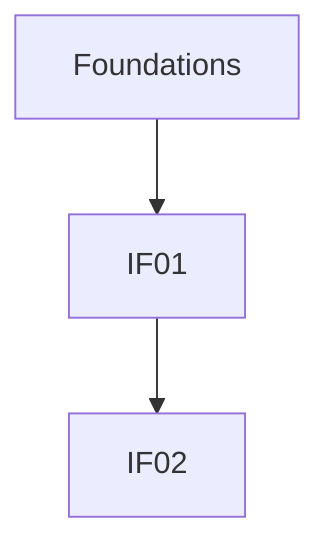
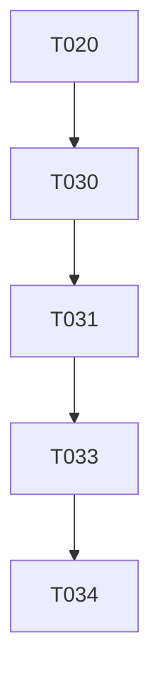

---

description: "Task list template for feature implementation"
---

# Tasks: [FEATURE NAME]

**Input**: Design documents from `/specs/[###-feature-name]/`
**Prerequisites**: plan.md (required), spec.md (required for user story traceability), data-model.md (required), contracts/ (required, non-empty), research.md, quickstart.md

**Tests**: Automated tests are OPTIONAL. Every interface MUST include at least one verification task (`[Type:Test] [IFxx]`), which may be automated or scripted.

**Organization**: Tasks are grouped by interface (delivery units). User stories are captured via an interface ↔ user story mapping table for traceability.

## Format: `T### [P?] [Type:...] [IFxx?] Description`

- **[P]**: Can run in parallel (different files, no dependencies)
- **[Type:...]**: REQUIRED on every task (Research, Interface, Test, Infra, Docs)
- **[IFxx]**: REQUIRED for `Type:Interface` and `Type:Test` tasks
- **[USx]**: OPTIONAL only (primary traceability is via mapping tables)
- Include exact file paths in descriptions (or explicit N/A only for tasks that do not modify repository files)
- **Evidence SSOT**: If the project constitution includes an Architecture Evidence Index with `AEI-###` IDs, then any task that references an **Existing** entry point or boundary MUST include the corresponding `AEI-###` in the description or in the interface detail doc it produces. Do NOT duplicate the repo boundary index in tasks.md.

## Task Types

- **Research**: Time-boxed spikes that support planning decisions (e.g., library choice, patterns, integrations)
- **Interface**: Implement an interface contract (endpoint/command/public API/UI contract) for an InterfaceID
- **Test**: Automated tests (contract/integration/unit) or scripted verification for an InterfaceID
- **Infra**: Shared scaffolding (repo structure, tooling, CI hooks, shared runtime concerns)
- **Docs**: Documentation updates (docs/, README, usage notes)

## Interface Inventory

> If `contracts/openapi.yaml` exists, the /speckit.tasks command assigns Interface IDs from OpenAPI operations (sorted by `operationId`) as IF01, IF02, ...  
> Otherwise, if `contracts/*.md` exists, it assigns Interface IDs from contract docs (sorted paths).

| InterfaceID | Interface | Detail Doc | Served User Stories |
| --- | --- | --- | --- |
| IF01 | `operationId`: createUser (or contract doc path) | specs/[###-feature-name]/contracts/interface-details/createUser.md (or N/A) | US1, US2 |

## Path Conventions

- **Single project**: `src/`, `tests/` at repository root
- **Web app**: `backend/src/`, `frontend/src/`
- **Mobile**: `api/src/`, `ios/src/` or `android/src/`
- Paths shown below assume single project - adjust based on plan.md structure

<!-- 
  ============================================================================
  IMPORTANT: The tasks below are SAMPLE TASKS for illustration purposes only.
  
	  The /speckit.tasks command MUST replace these with actual tasks based on:
	  - Interface contracts from contracts/ (primary driver when present)
	  - Feature requirements from plan.md
	  - Entities from data-model.md (mapped to interfaces)
	  - User stories from spec.md (traceability: interface ↔ user story mapping)
	  
	  Tasks MUST be organized by interface so each interface can be:
	  - Delivered independently
	  - Verified independently
	  - Merged independently
	  
	  DO NOT keep these sample tasks in the generated tasks.md file.
	  ============================================================================
	-->

## Phase 0 (Optional): Research Spikes

**Purpose**: Time-boxed investigations to resolve explicit unknowns/decisions

- [ ] T001 [Type:Research] Evaluate [library/pattern] for [need] and record decision in specs/[###-feature-name]/research.md
- [ ] T002 [Type:Research] Validate integration approach for [system] and record tradeoffs in specs/[###-feature-name]/research.md

---

## Phase 1: Setup (Shared Infrastructure)

**Purpose**: Project initialization and basic structure

- [ ] T010 [Type:Infra] Create project structure per implementation plan in src/ and tests/
- [ ] T011 [Type:Infra] Initialize [language] project with [framework] dependencies in [path]
- [ ] T012 [P] [Type:Infra] Configure linting and formatting tools in [config paths]

---

## Phase 2: Foundations (Blocking Prerequisites)

**Purpose**: Core infrastructure that MUST be complete before ANY interface can be implemented

**⚠️ CRITICAL**: No interface work can begin until this phase is complete

Examples of foundational tasks (adjust based on your project):

- [ ] T020 [Type:Infra] Setup database schema and migrations framework in [path]
- [ ] T021 [P] [Type:Infra] Implement authentication/authorization framework in [paths]
- [ ] T022 [P] [Type:Infra] Setup API routing and middleware structure in [paths]
- [ ] T023 [Type:Infra] Create base models/entities shared by multiple interfaces in [paths]
- [ ] T024 [Type:Infra] Configure error handling and logging infrastructure in [paths]
- [ ] T025 [Type:Infra] Setup environment configuration management in [paths]

**Checkpoint**: Foundation ready - interface delivery can now begin in parallel

---

## Phase 3+: Interfaces (Delivery Units)

> Repeat the pattern below for every InterfaceID in the Interface Inventory.

### IF01 — [Interface Name] (🎯 MVP)

**Goal**: [Brief description of what this interface delivers]

**Contract**: specs/[###-feature-name]/contracts/openapi.yaml (`operationId`: [operationId]) or specs/[###-feature-name]/contracts/[interface].md (or N/A)

**Interface Detail**: specs/[###-feature-name]/contracts/interface-details/[operationId].md (OpenAPI only; or N/A)

**Served User Stories**: US1, US2

**Definition of Done**:
- [Interface behavior observable and matches contract/spec]
- [Verification completed (automated or scripted)]

#### Tests / Verification (REQUIRED)

> Automated tests are OPTIONAL. Always include at least one verification task.

- [ ] T030 [P] [Type:Test] [IF01] Add contract/integration test in tests/contract/test_[name].py
- [ ] T031 [Type:Test] [IF01] Script quickstart verification in specs/[###-feature-name]/quickstart.md (if no test framework)

#### Implementation (REQUIRED)

- [ ] T032 [P] [Type:Interface] [IF01] Implement [handler/service] in src/[location]/[file].py
- [ ] T033 [Type:Interface] [IF01] Wire interface entrypoint in src/[location]/[file].py (depends on T032)
- [ ] T034 [Type:Interface] [IF01] Add validation/error handling in src/[location]/[file].py

**Checkpoint**: IF01 is complete and verified independently

---

### IF02 — [Interface Name]

[Repeat the same structure: Tests/Verification -> Implementation -> Checkpoint]

---

## Phase N: Polish & Cross-Cutting Concerns

**Purpose**: Improvements that affect multiple interfaces

- [ ] T900 [P] [Type:Docs] Documentation updates in docs/
- [ ] T901 [Type:Infra] Code cleanup and refactoring in [paths]
- [ ] T902 [Type:Infra] Performance optimization across interfaces in [paths]
- [ ] T903 [P] [Type:Test] Additional unit tests (if requested) in tests/unit/
- [ ] T904 [Type:Infra] Security hardening in [paths]
- [ ] T905 [Type:Test] Run quickstart.md validation via specs/[###-feature-name]/quickstart.md

---

## DAG

### Interface DAG (Mermaid)



### Task DAG (Mermaid)



### Task DAG (Adjacency List)

```text
T020 -> T030  # Foundations must be complete before interface work
T030 -> T031  # Verification preparation before implementation
T031 -> T033  # Verification setup before (or alongside) implementation
T033 -> T034  # Wire-up after core implementation
```

Notes:
- Every edge MUST reference a valid TaskID present in this file.
- Every `[P]` task MUST be consistent with the DAG (no blocking dependencies) and avoid shared-file conflicts.

---

## Parallel Example: IF01

```bash
# Launch multiple IF01 tasks together when marked [P] and no shared-file conflicts:
Task: "T030 [Type:Test] [IF01] Add contract/integration test in tests/contract/test_[name].py"
Task: "T032 [Type:Interface] [IF01] Implement [handler/service] in src/[location]/[file].py"
```

---

## Implementation Strategy

### MVP First (IF01 Only)

1. Complete Phase 1: Setup
2. Complete Phase 2: Foundations (CRITICAL - blocks all interfaces)
3. Complete IF01 (verification -> implementation)
4. **STOP and VALIDATE**: Verify IF01 independently
5. Deploy/demo if ready

### Incremental Delivery

1. Complete Setup + Foundations -> Foundation ready
2. Add IF01 -> Verify independently -> Deploy/Demo (MVP!)
3. Add IF02 -> Verify independently -> Deploy/Demo
4. Add IF03 -> Verify independently -> Deploy/Demo
5. Each interface adds value without breaking previous interfaces

### Parallel Team Strategy

With multiple developers:

1. Team completes Setup + Foundations together
2. Once Foundations is done:
   - Developer A: IF01
   - Developer B: IF02
   - Developer C: IF03
3. Interfaces complete and merge independently

---

## Notes

- `[Type:...]` is REQUIRED on every task
- `[IFxx]` is REQUIRED for `Type:Interface` and `Type:Test` tasks
- `[P]` tasks must be DAG-consistent and avoid shared-file conflicts
- Each interface should be independently deliverable and verifiable
- Prefer tests/verification before or alongside implementation
- Commit after each task or logical group
- Stop at any checkpoint to validate an interface independently
- Avoid: vague tasks, shared-file conflicts, cross-interface dependencies that break independent delivery
